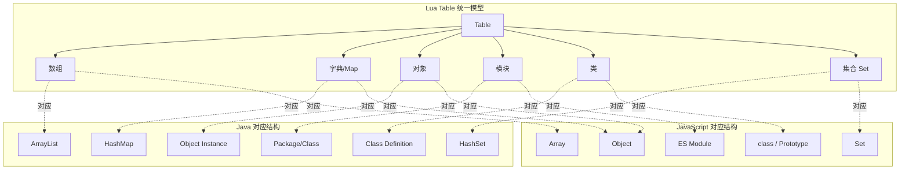
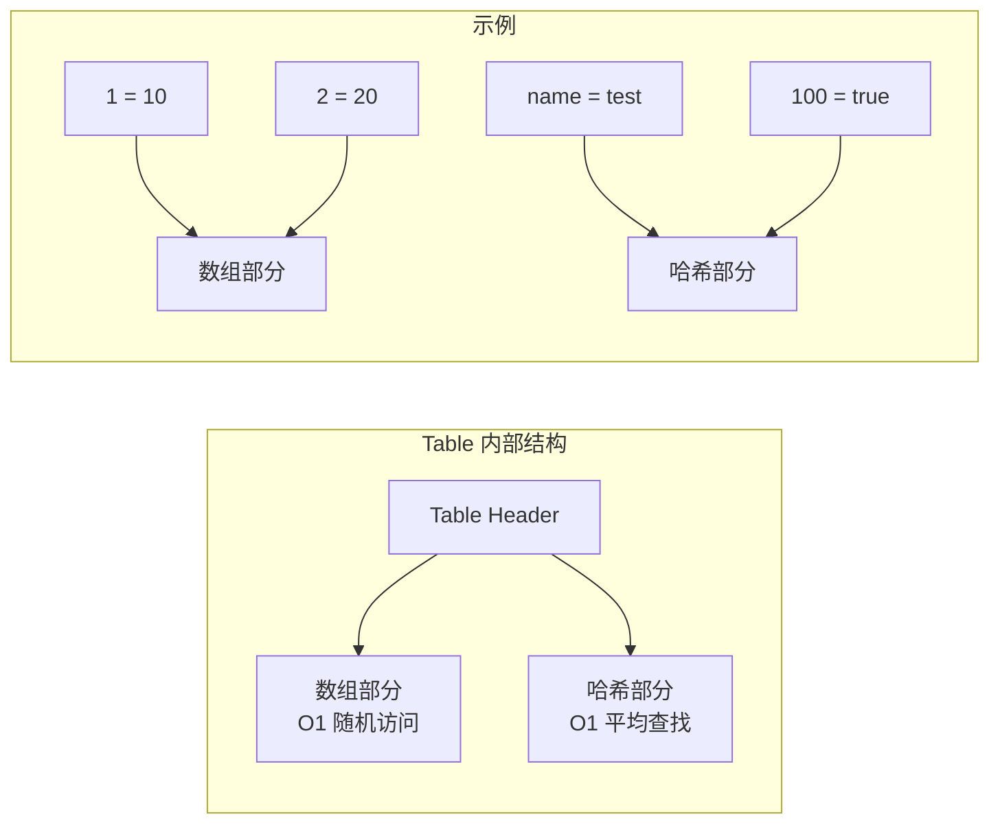
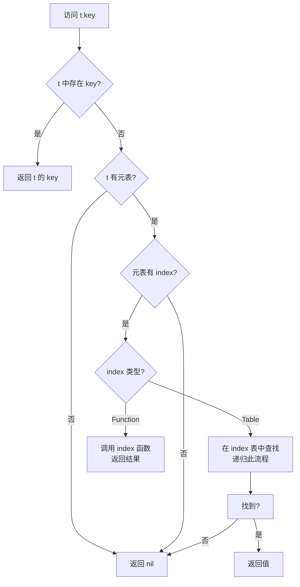
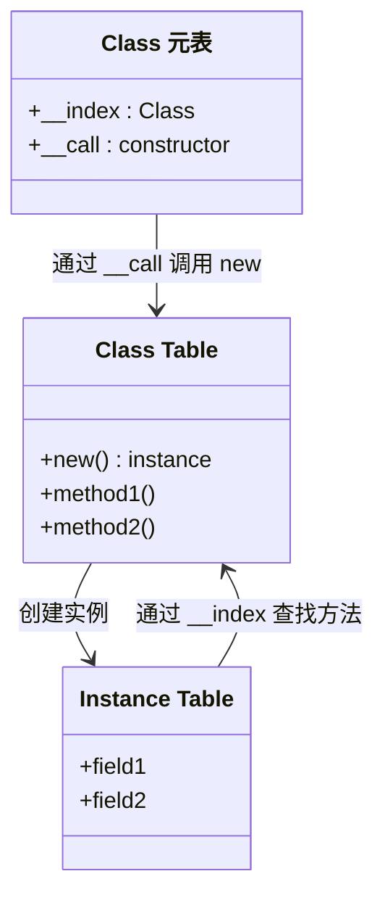
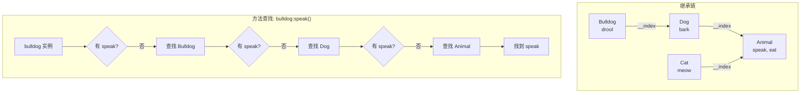
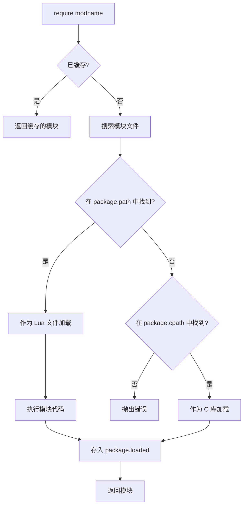
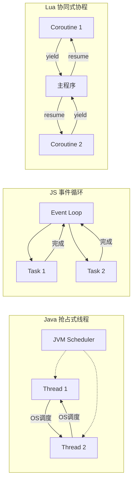
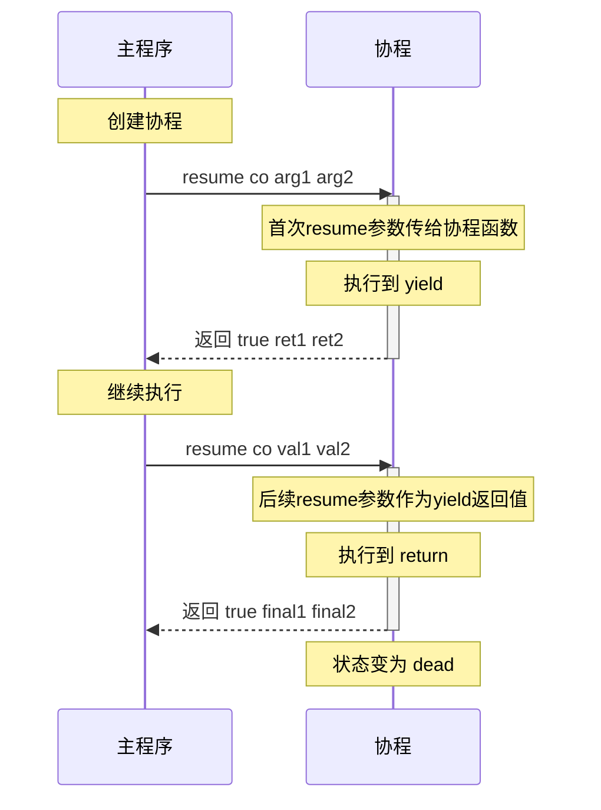
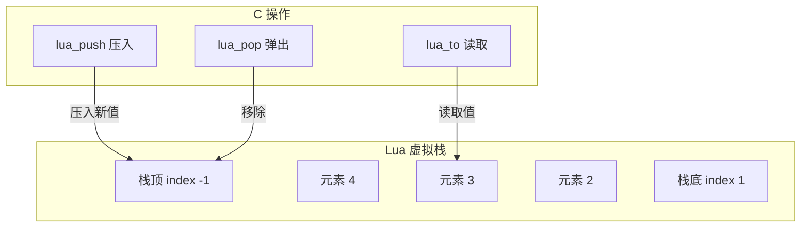

# Lua 深度入门：从 Java & Vue 开发者的思维模型迁移

> **目标读者**：具备 Java 后端或 Vue/TypeScript 前端经验，零 Lua 基础的开发者  
> **核心目标**：建立 Lua 思维模型，理解底层机制，快速上手工程实践

---

## 1. 语言范式转换 (Paradigm Shift)

### 1.1 核心差异对照

| 维度         | Java                    | JavaScript               | Lua                       |
| ------------ | ----------------------- | ------------------------ | ------------------------- |
| **类型系统** | 静态强类型，编译期检查  | 动态弱类型，运行时确定   | 动态强类型，运行时确定    |
| **内存管理** | JVM GC（分代收集）      | 引擎 GC（标记清除+分代） | 增量式 GC（标记清除）     |
| **执行模型** | 编译为字节码，JIT       | 解释执行/JIT             | 编译为字节码，可选 LuaJIT |
| **并发模型** | 抢占式多线程            | 单线程 + 事件循环        | 协同式协程（非抢占）      |
| **核心容器** | ArrayList, HashMap 分离 | Array, Object 分离       | **Table 统一一切**        |
| **面向对象** | 原生 class/interface    | 原型链继承               | 元表模拟（无原生 class）  |

**关键思维迁移**：

- 从 Java 来：放弃编译期类型安全，拥抱运行时灵活性；忘记 class 关键字，用 Table + 元表构建对象
- 从 JS 来：协程替代 Promise/async-await；Table 比 Object 更统一；注意 1-based 索引

#### 动态强类型 vs 动态弱类型

Lua 是**动态强类型**语言，这与 JavaScript 的动态弱类型有本质区别：

```lua
-- 【Lua】强类型：不同类型不会隐式转换
local a = "10"
local b = 20
-- print(a + b)  -- 错误！attempt to perform arithmetic on a string value

-- 必须显式转换
print(tonumber(a) + b)  -- 30
print(a .. tostring(b)) -- "1020"
```

```javascript
// 【JS】弱类型：隐式类型转换
const a = "10";
const b = 20;
console.log(a + b);   // "1020"（字符串拼接）
console.log(a - b);   // -10（隐式转为数字）
console.log(a == 10); // true（类型转换后比较）
```

```java
// 【Java】静态强类型：编译期检查
String a = "10";
int b = 20;
// System.out.println(a + b);  // "1020"，Java 对 + 有特殊处理
System.out.println(Integer.parseInt(a) + b);  // 30
```

**实践意义**：在 Lua 中，你不会遇到 JS 那样的 `"" == false` 或 `[] == false` 等令人困惑的隐式转换，但需要手动处理类型转换。

### 1.2 Lua 的独特设计哲学

Lua 诞生于 1993 年巴西，设计目标是**嵌入式脚本语言**——小巧（解释器仅约 200KB）、快速、可嵌入。这决定了它的核心取舍：

#### 1-based 索引

```lua
-- 【Lua】索引从 1 开始
local arr = {"a", "b", "c"}
print(arr[1])  -- 输出 "a"
print(arr[0])  -- 输出 nil（不是越界错误！）

-- 遍历时的体现
for i = 1, #arr do
    print(i, arr[i])
end
-- 输出：1 a, 2 b, 3 c
```

```java
// 【Java】索引从 0 开始
String[] arr = {"a", "b", "c"};
System.out.println(arr[0]);  // 输出 "a"
// arr[3] 会抛出 ArrayIndexOutOfBoundsException
```

```javascript
// 【JS】索引从 0 开始
const arr = ["a", "b", "c"];
console.log(arr[0]);  // "a"
console.log(arr[3]);  // undefined（不是错误）
```

**设计考量**：源于 Lua 早期用户（非程序员的工程师）的使用习惯，与数学/工程领域一致。  
**痛点**：与 C/Java/JS 生态交互时需时刻注意边界转换。

**常见错误场景**：

```lua
-- 与 C 库交互时
local c_array_index = 0  -- C 返回的索引
local lua_index = c_array_index + 1  -- 转换为 Lua 索引

-- 循环边界
local arr = {"a", "b", "c"}
for i = 0, #arr - 1 do  -- 错误！会漏掉最后一个元素
    print(arr[i])
end

for i = 1, #arr do  -- 正确
    print(arr[i])
end
```

#### 默认全局变量

```lua
-- 【Lua】未声明 local 的变量默认为全局
function example()
    count = 10          -- 危险！污染全局命名空间
    local safe = 20     -- 正确：局部变量
end

example()
print(count)  -- 10，全局变量在函数外可访问
print(safe)   -- nil，局部变量已离开作用域
```

**设计考量**：简化入门门槛，减少语法噪音。  
**最佳实践**：**始终使用 `local`**，必要时通过 linter 强制检查。

**全局变量的本质**：

```lua
-- 全局变量实际上是 _G 表的字段
globalVar = 100
print(_G.globalVar)     -- 100
print(_G["globalVar"])  -- 100

-- 可以遍历所有全局变量
for k, v in pairs(_G) do
    print(k, type(v))
end
```

**防御性编程**：

```lua
-- 方法1：严格模式，禁止创建新全局变量
local function strict_mode()
    setmetatable(_G, {
        __newindex = function(t, k, v)
            error("Attempt to create global variable: " .. tostring(k), 2)
        end,
        __index = function(t, k)
            error("Attempt to read undefined global: " .. tostring(k), 2)
        end
    })
end

strict_mode()
-- x = 1        -- 运行时错误！
-- print(y)     -- 运行时错误！
local x = 1     -- 正确
```

#### nil 与 false 的布尔判定

```lua
-- 【Lua】仅 nil 和 false 为假，其他所有值均为真
if 0 then print("0 is truthy") end            -- 输出！
if "" then print("empty string is truthy") end -- 输出！
if {} then print("empty table is truthy") end  -- 输出！

if nil then print("nil") else print("nil is falsy") end    -- nil is falsy
if false then print("false") else print("false is falsy") end  -- false is falsy
```

```javascript
// 【JS】多种 falsy 值
if (0) console.log("0");           // 不输出
if ("") console.log("empty");      // 不输出
if (null) console.log("null");     // 不输出
if (undefined) console.log("undefined"); // 不输出
if (NaN) console.log("NaN");       // 不输出
```

**实践中的差异**：

```lua
-- 【Lua】检查字符串是否为空
local str = ""
if str then
    print("字符串存在")  -- 会执行！空字符串也是 truthy
end

-- 正确做法
if str and str ~= "" then
    print("字符串非空")
end

-- 或使用长度检查
if #str > 0 then
    print("字符串非空")
end
```

```lua
-- 【Lua】检查数字是否有效
local num = 0
if num then
    print("数字存在")  -- 会执行！0 也是 truthy
end

-- 如果要区分 0 和 nil
if num ~= nil then
    print("数字已定义（可能是0）")
end
```

#### 短路求值与惯用法

```lua
-- and/or 返回决定结果的操作数，而非布尔值
print(1 and 2)      -- 2（第一个为真，返回第二个）
print(nil and 2)    -- nil（第一个为假，返回第一个）
print(1 or 2)       -- 1（第一个为真，返回第一个）
print(nil or 2)     -- 2（第一个为假，返回第二个）

-- 惯用法：默认值
local function greet(name)
    name = name or "World"  -- 如果 name 为 nil，使用默认值
    print("Hello, " .. name)
end
greet()         -- Hello, World
greet("Lua")    -- Hello, Lua

-- 陷阱：当合法值是 false 时
local function process(flag)
    flag = flag or true  -- 错误！false 会被替换为 true
    -- 正确做法
    if flag == nil then
        flag = true
    end
end

-- 三元运算符模拟
local x = 10
local result = (x > 5) and "big" or "small"  -- "big"

-- 陷阱：当真值分支返回 false 或 nil 时
local y = true
local result = y and false or "default"  -- "default"（不是期望的 false！）
-- 因为 y and false 返回 false，然后 false or "default" 返回 "default"
```

### 1.3 基础语法速览

#### 变量声明与作用域

```lua
-- 局部变量（推荐）
local name = "Lua"
local x, y, z = 1, 2, 3  -- 多重赋值

-- 多重赋值的值数量不匹配时
local a, b, c = 1, 2     -- a=1, b=2, c=nil
local d, e = 1, 2, 3     -- d=1, e=2, 3 被丢弃

-- 交换变量（无需临时变量）
x, y = y, x

-- 全局变量（避免使用）
GlobalConfig = {}

-- 作用域演示
local outer = "outer"
do  -- do-end 创建新作用域
    local inner = "inner"
    print(outer)  -- 可访问外层
    print(inner)  -- 可访问本层
end
print(outer)  -- 可访问
-- print(inner)  -- 错误！inner 已离开作用域
```

```lua
-- 变量遮蔽（Shadowing）
local x = 10
do
    local x = 20  -- 新变量，遮蔽外层 x
    print(x)      -- 20
end
print(x)          -- 10，外层 x 未受影响
```

#### 基本数据类型

Lua 仅有 **8 种类型**：nil, boolean, number, string, function, table, userdata, thread

```lua
-- nil：表示"无值"
local nothing = nil
print(type(nothing))  -- "nil"

-- boolean
local yes = true
local no = false
print(type(yes))  -- "boolean"

-- number（Lua 5.3 起区分 integer 和 float）
local int_num = 42
local float_num = 3.14
local sci_num = 1.5e10
local hex_num = 0xFF        -- 255
print(type(int_num))        -- "number"
print(math.type(int_num))   -- "integer"（Lua 5.3+）
print(math.type(float_num)) -- "float"（Lua 5.3+）

-- string（不可变）
local s1 = "hello"
local s2 = 'world'
local s3 = [[
    多行字符串
    保留换行和缩进
]]
local s4 = [==[
    可以包含 [[嵌套]] 括号
    使用等号区分层级
]==]
print(type(s1))  -- "string"
print(#s1)       -- 5（字符串长度）

-- function
local f = function() end
print(type(f))  -- "function"

-- table（万能容器）
local t = {}
print(type(t))  -- "table"

-- userdata（C 数据，Lua 中无法直接创建）
-- thread（协程）
local co = coroutine.create(function() end)
print(type(co))  -- "thread"
```

#### 字符串操作

```lua
-- 拼接（使用 .. 而非 +）
local greeting = "Hello" .. " " .. "World"

-- 长度
print(#greeting)  -- 11

-- 常用函数
print(string.upper("hello"))        -- "HELLO"
print(string.lower("HELLO"))        -- "hello"
print(string.sub("hello", 2, 4))    -- "ell"（索引从1开始，包含两端）
print(string.sub("hello", 2))       -- "ello"（从第2个到末尾）
print(string.sub("hello", -2))      -- "lo"（负索引从末尾算）
print(string.find("hello", "ll"))   -- 3, 4（起始和结束位置）
print(string.gsub("hello", "l", "L"))  -- "heLLo", 2（替换结果和替换次数）
print(string.format("x=%d, y=%.2f", 10, 3.14159))  -- "x=10, y=3.14"

-- 字符串与数字转换
print(tonumber("42"))     -- 42
print(tonumber("3.14"))   -- 3.14
print(tonumber("abc"))    -- nil（转换失败）
print(tonumber("FF", 16)) -- 255（指定基数）
print(tostring(42))       -- "42"
print(tostring(nil))      -- "nil"

-- 性能注意：频繁拼接使用 table.concat
local parts = {}
for i = 1, 1000 do
    parts[i] = "item" .. i
end
local result = table.concat(parts, ", ")  -- 高效
```

#### 运算符对照

```lua
-- 算术运算符
print(10 + 3)   -- 13
print(10 - 3)   -- 7
print(10 * 3)   -- 30
print(10 / 3)   -- 3.3333...（浮点除法）
print(10 // 3)  -- 3（整数除法，Lua 5.3+）
print(10 % 3)   -- 1（取模）
print(10 ^ 2)   -- 100（幂运算）
print(-10)      -- -10（取负）

-- 关系运算符
print(10 == 10)  -- true
print(10 ~= 5)   -- true（不等于，注意是 ~= 不是 !=）
print(10 > 5)    -- true
print(10 < 5)    -- false
print(10 >= 10)  -- true
print(10 <= 5)   -- false

-- 逻辑运算符
print(not true)       -- false
print(true and false) -- false
print(true or false)  -- true

-- 位运算符（Lua 5.3+）
print(5 & 3)   -- 1（按位与）
print(5 | 3)   -- 7（按位或）
print(5 ~ 3)   -- 6（按位异或，注意不是 ^）
print(~5)      -- -6（按位取反）
print(5 << 2)  -- 20（左移）
print(20 >> 2) -- 5（右移）
```

**与 Java/JS 的运算符差异**：

| 操作       | Java         | JavaScript     | Lua   |
| ---------- | ------------ | -------------- | ----- |
| 不等于     | `!=`         | `!==`          | `~=`  |
| 逻辑非     | `!`          | `!`            | `not` |
| 逻辑与     | `&&`         | `&&`           | `and` |
| 逻辑或     | `\|\|`       | `\|\|`         | `or`  |
| 字符串拼接 | `+`          | `+`            | `..`  |
| 整数除法   | 整数/整数    | `Math.floor()` | `//`  |
| 幂运算     | `Math.pow()` | `**`           | `^`   |
| 按位异或   | `^`          | `^`            | `~`   |

#### 控制结构

```lua
-- if-elseif-else（注意：elseif 是一个词，不是 else if）
local score = 85
if score >= 90 then
    print("A")
elseif score >= 80 then
    print("B")
elseif score >= 60 then
    print("C")
else
    print("F")
end

-- 注意：没有 switch/case，通常用 table 查找替代
local handlers = {
    add = function(a, b) return a + b end,
    sub = function(a, b) return a - b end,
    mul = function(a, b) return a * b end,
}
local op = "add"
local result = handlers[op](10, 5)  -- 15
```

```lua
-- 数值 for 循环
-- for var = start, stop [, step] do ... end
-- 特点：包含 stop 值，step 默认为 1

for i = 1, 5 do           -- 1, 2, 3, 4, 5
    print(i)
end

for i = 1, 10, 2 do       -- 1, 3, 5, 7, 9（步长为2）
    print(i)
end

for i = 10, 1, -1 do      -- 10, 9, 8, ..., 1（倒序）
    print(i)
end

-- 注意：循环变量是局部的，循环体内修改不影响迭代
for i = 1, 5 do
    print(i)
    i = i + 10  -- 这不会跳过迭代！
end
-- 输出：1, 2, 3, 4, 5
```

```lua
-- 泛型 for 循环（迭代器模式）
local arr = {"a", "b", "c"}

-- ipairs：遍历数组部分（连续整数键，从1开始）
for index, value in ipairs(arr) do
    print(index, value)
end
-- 1 a, 2 b, 3 c

-- pairs：遍历所有键值对（顺序不保证）
local mixed = {10, 20, name = "test", 30}
for key, value in pairs(mixed) do
    print(key, value)
end
-- 可能输出：1 10, 2 20, 3 30, name test（顺序不定）
```

```lua
-- while 循环
local i = 1
while i <= 5 do
    print(i)
    i = i + 1  -- 注意：Lua 无 ++/-- 运算符
end

-- repeat-until 循环（类似 do-while，但条件为真时退出）
local j = 1
repeat
    print(j)
    j = j + 1
until j > 5  -- 条件为真时退出

-- repeat-until 的特殊之处：条件可以访问循环体内的局部变量
repeat
    local line = io.read()
until line == "quit"  -- line 在此处可见
```

```lua
-- break：退出当前循环
for i = 1, 10 do
    if i > 5 then
        break
    end
    print(i)
end

-- 注意：Lua 5.1 没有 continue，需要变通
-- 方法1：使用条件跳过
for i = 1, 10 do
    if i % 2 == 0 then
        -- 跳过偶数
    else
        print(i)  -- 只处理奇数
    end
end

-- 方法2：使用 goto（Lua 5.2+）
for i = 1, 10 do
    if i % 2 == 0 then
        goto continue
    end
    print(i)
    ::continue::
end
```

#### 函数定义与调用

```lua
-- 基本定义
local function add(a, b)
    return a + b
end

-- 等价的匿名函数赋值
local multiply = function(a, b)
    return a * b
end

-- 注意两种定义的细微差别
-- local function foo() ... end 可以递归
local function factorial(n)
    if n <= 1 then return 1 end
    return n * factorial(n - 1)  -- 可以调用自己
end

-- local bar = function() ... end 递归需要先声明
local fib
fib = function(n)
    if n <= 2 then return 1 end
    return fib(n - 1) + fib(n - 2)
end
```

```lua
-- 多返回值（Lua 特色）
local function minmax(...)
    local args = {...}
    local min, max = args[1], args[1]
    for i = 2, #args do
        if args[i] < min then min = args[i] end
        if args[i] > max then max = args[i] end
    end
    return min, max
end

local lo, hi = minmax(3, 1, 4, 1, 5, 9, 2, 6)
print(lo, hi)  -- 1, 9

-- 返回值数量调整
local function three()
    return 1, 2, 3
end

local a, b, c = three()      -- a=1, b=2, c=3
local x, y = three()         -- x=1, y=2, 第三个被丢弃
local m = three()            -- m=1，只取第一个
local t = {three()}          -- t={1, 2, 3}，全部收集
print(three())               -- 1 2 3，全部打印
print(three(), "end")        -- 1 end，只取第一个
print("start", three())      -- start 1 2 3，最后位置取全部
```

```lua
-- 变参函数
local function printf(fmt, ...)
    print(string.format(fmt, ...))
end
printf("Name: %s, Age: %d", "Lua", 30)

-- 获取变参信息
local function varargs(...)
    local args = {...}      -- 收集为 table
    local n = select("#", ...)  -- 获取参数个数（包括 nil）
    print("参数个数:", n)
    
    -- select(i, ...) 返回第 i 个及之后的参数
    print("从第2个开始:", select(2, ...))
end
varargs(1, nil, 3)  -- 参数个数: 3
```

```lua
-- 具名参数模拟（使用 table）
local function create_window(options)
    local title = options.title or "Untitled"
    local width = options.width or 800
    local height = options.height or 600
    print(string.format("Window: %s (%dx%d)", title, width, height))
end

-- 调用时使用 table，语法糖允许省略括号
create_window{title = "My App", width = 1024}
-- 等价于 create_window({title = "My App", width = 1024})
```

---

## 2. 核心容器：Table 的统一性与灵活性

### 2.1 Table 的多重角色

Lua 的 Table 是**唯一的复合数据结构**，统一扮演数组、字典、对象、模块等角色。这种设计极大简化了语言复杂度，但也需要开发者理解其内部机制。



### 2.2 Table 的内部结构

理解 Table 内部实现有助于写出高性能代码：



```lua
-- 高性能：连续整数键使用数组部分
local dense = {}
for i = 1, 100000 do
    dense[i] = i * 2  -- 数组部分，连续内存
end

-- 低性能：稀疏整数键退化为哈希部分
local sparse = {}
sparse[1] = "a"
sparse[1000000] = "b"  -- 触发哈希部分存储

-- 混合使用
local mixed = {"a", "b", "c"}  -- 数组部分
mixed.name = "test"             -- 哈希部分
mixed[100] = "sparse"           -- 可能在哈希部分
```

### 2.3 语法与使用详解

#### 创建与初始化

```lua
-- 空表
local empty = {}

-- 数组风格（连续整数键，自动从 1 开始）
local fruits = {"apple", "banana", "cherry"}
-- 内部等价于：{[1] = "apple", [2] = "banana", [3] = "cherry"}

-- 字典风格
local person = {
    name = "Alice",      -- 语法糖：等价于 ["name"] = "Alice"
    age = 30,
    ["full-name"] = "Alice Smith",  -- 特殊字符键必须用 []
    [1] = "first",       -- 数字键必须用 []
    [true] = "yes",      -- 布尔键必须用 []
}

-- 混合风格
local mixed = {
    "first",        -- [1] = "first"
    "second",       -- [2] = "second"
    name = "test",  -- ["name"] = "test"
    "third",        -- [3] = "third"
    [10] = "ten",   -- 显式整数键
}

-- 嵌套表
local config = {
    database = {
        host = "localhost",
        port = 5432,
    },
    cache = {
        enabled = true,
        ttl = 3600,
    },
}

-- 表作为键（引用比较）
local key1 = {}
local key2 = {}
local t = {
    [key1] = "value1",
    [key2] = "value2",
}
print(t[key1])  -- "value1"
print(t[{}])    -- nil（新表是不同的引用）
```

#### 索引访问

```lua
local t = {name = "Lua", version = 5.4}

-- 点语法（仅限合法标识符键）
print(t.name)     -- "Lua"
print(t.version)  -- 5.4

-- 方括号语法（任意键）
print(t["name"])  -- "Lua"
local key = "version"
print(t[key])     -- 5.4（动态键名）

-- 两种语法的区别
t.123 = "error"    -- 语法错误！
t["123"] = "ok"    -- 正确（字符串键）
t[123] = "number"  -- 正确（数字键）

-- 访问不存在的键返回 nil（不报错）
print(t.unknown)  -- nil
print(t[999])     -- nil

-- 链式访问的安全问题
local config = {database = {host = "localhost"}}
-- print(config.cache.host)  -- 错误！attempt to index nil value

-- 安全访问方式
print(config.cache and config.cache.host)  -- nil
-- 或使用辅助函数
local function safe_get(t, ...)
    for _, k in ipairs({...}) do
        if type(t) ~= "table" then return nil end
        t = t[k]
    end
    return t
end
print(safe_get(config, "cache", "host"))  -- nil
print(safe_get(config, "database", "host"))  -- "localhost"
```

#### 修改与删除

```lua
local t = {a = 1, b = 2}

-- 添加/修改
t.c = 3
t["d"] = 4
t.a = 100  -- 修改已有键

-- 删除（赋值为 nil）
t.b = nil
print(t.b)  -- nil

-- 注意：数组中赋值 nil 会产生"空洞"
local arr = {1, 2, 3, 4, 5}
arr[3] = nil  -- 危险！产生空洞
print(#arr)   -- 结果不确定，可能是 2 或 5

-- 正确的数组删除：使用 table.remove
local arr2 = {1, 2, 3, 4, 5}
table.remove(arr2, 3)  -- 删除第3个元素，后续元素前移
-- arr2 = {1, 2, 4, 5}
print(#arr2)  -- 4
```

#### 遍历详解

```lua
-- ipairs：遍历数组部分
-- 从索引 1 开始，遇到 nil 停止
local arr = {10, 20, nil, 40}  -- 注意：有 nil
for i, v in ipairs(arr) do
    print(i, v)
end
-- 输出：1 10, 2 20（在 nil 处停止）

-- pairs：遍历所有键值对
-- 顺序不保证，但会遍历所有非 nil 值
local t = {10, 20, name = "test", [100] = "sparse"}
for k, v in pairs(t) do
    print(k, v)
end
-- 可能输出：1 10, 2 20, name test, 100 sparse（顺序不定）

-- 只遍历键
for k in pairs(t) do
    print(k)
end

-- 安全删除遍历（遍历中删除需要特殊处理）
-- 错误做法：
local data = {a = 1, b = 2, c = 3}
for k, v in pairs(data) do
    if v > 1 then
        data[k] = nil  -- 可能导致遍历问题
    end
end

-- 正确做法：先收集再删除
local to_remove = {}
for k, v in pairs(data) do
    if v > 1 then
        to_remove[#to_remove + 1] = k
    end
end
for _, k in ipairs(to_remove) do
    data[k] = nil
end
```

```lua
-- 自定义迭代器
local function range(start, stop, step)
    step = step or 1
    local i = start - step
    return function()
        i = i + step
        if (step > 0 and i <= stop) or (step < 0 and i >= stop) then
            return i
        end
    end
end

for i in range(1, 5) do
    print(i)
end
-- 1, 2, 3, 4, 5

for i in range(10, 1, -2) do
    print(i)
end
-- 10, 8, 6, 4, 2
```

### 2.4 Table 标准库函数

```lua
-- table.insert：插入元素
local arr = {1, 2, 3}
table.insert(arr, 4)        -- 末尾插入：{1, 2, 3, 4}
table.insert(arr, 2, 1.5)   -- 指定位置插入：{1, 1.5, 2, 3, 4}

-- table.remove：删除元素
local removed = table.remove(arr)      -- 删除末尾，返回被删除值
local removed2 = table.remove(arr, 2)  -- 删除指定位置

-- table.concat：连接数组元素为字符串
local words = {"Hello", "Lua", "World"}
print(table.concat(words))         -- "HelloLuaWorld"
print(table.concat(words, " "))    -- "Hello Lua World"
print(table.concat(words, ", ", 2, 3))  -- "Lua, World"（指定范围）

-- table.sort：原地排序
local nums = {3, 1, 4, 1, 5, 9, 2, 6}
table.sort(nums)  -- 默认升序：{1, 1, 2, 3, 4, 5, 6, 9}

-- 自定义比较函数
table.sort(nums, function(a, b)
    return a > b  -- 降序
end)

-- 复杂对象排序
local people = {
    {name = "Alice", age = 30},
    {name = "Bob", age = 25},
    {name = "Charlie", age = 35},
}
table.sort(people, function(a, b)
    return a.age < b.age
end)

-- table.pack / table.unpack（Lua 5.2+）
local packed = table.pack(1, 2, nil, 4)
print(packed.n)  -- 4（元素个数，包括 nil）

local a, b, c = table.unpack({10, 20, 30})
print(a, b, c)  -- 10, 20, 30

-- 指定范围 unpack
local arr = {1, 2, 3, 4, 5}
local x, y = table.unpack(arr, 2, 4)  -- 从索引2到4
print(x, y)  -- 2, 3（只接收两个）
```

### 2.5 常见模式与陷阱

#### Set（集合）模式

```lua
-- 使用 table 模拟 Set
local function Set(list)
    local set = {}
    for _, v in ipairs(list) do
        set[v] = true
    end
    return set
end

local fruits = Set{"apple", "banana", "cherry"}
print(fruits["apple"])   -- true
print(fruits["orange"])  -- nil

-- 集合操作
local function union(a, b)
    local result = {}
    for k in pairs(a) do result[k] = true end
    for k in pairs(b) do result[k] = true end
    return result
end

local function intersection(a, b)
    local result = {}
    for k in pairs(a) do
        if b[k] then result[k] = true end
    end
    return result
end
```

#### 数组长度陷阱

```lua
-- # 运算符的行为
local arr1 = {1, 2, 3}
print(#arr1)  -- 3

local arr2 = {1, 2, nil, 4}
print(#arr2)  -- 未定义行为！可能是 2 或 4

local arr3 = {}
arr3[1] = "a"
arr3[2] = "b"
arr3[100] = "c"
print(#arr3)  -- 未定义行为！可能是 2 或 100

-- 安全做法：手动维护长度
local safe_arr = {n = 0}
local function push(arr, value)
    arr.n = arr.n + 1
    arr[arr.n] = value
end
push(safe_arr, "a")
push(safe_arr, "b")
print(safe_arr.n)  -- 2

-- 或使用 table.pack
local packed = table.pack(1, nil, 3)
print(packed.n)  -- 3
```

#### 浅拷贝与深拷贝

```lua
-- 浅拷贝
local function shallow_copy(t)
    local copy = {}
    for k, v in pairs(t) do
        copy[k] = v
    end
    return copy
end

-- 深拷贝
local function deep_copy(t, seen)
    if type(t) ~= "table" then return t end
    seen = seen or {}
    if seen[t] then return seen[t] end
    
    local copy = {}
    seen[t] = copy
    for k, v in pairs(t) do
        copy[deep_copy(k, seen)] = deep_copy(v, seen)
    end
    return setmetatable(copy, getmetatable(t))
end

-- 使用示例
local original = {
    name = "test",
    nested = {value = 42}
}

local shallow = shallow_copy(original)
shallow.nested.value = 100
print(original.nested.value)  -- 100（被修改了！）

local deep = deep_copy(original)
deep.nested.value = 200
print(original.nested.value)  -- 100（未受影响）
```

---

## 3. 进阶机制：元表 (Metatable) 与对象模型模拟

### 3.1 机制类比与核心概念

| 概念           | Java                  | JavaScript            | Lua                      |
| -------------- | --------------------- | --------------------- | ------------------------ |
| 运行时行为定制 | 反射 / 动态代理       | Proxy / Reflect       | 元表 (Metatable)         |
| 继承链         | extends + super       | `__proto__` 链        | `__index` 链             |
| 运算符重载     | 不支持（Kotlin 支持） | Symbol.toPrimitive 等 | `__add`, `__eq` 等元方法 |
| 属性拦截       | 动态代理              | Proxy get/set         | `__index` / `__newindex` |

**核心理解**：元表是附加在 Table 上的"行为定义表"，当对 Table 执行特定操作（如访问不存在的键、相加）时，Lua 会查找元表中的元方法来决定行为。

```lua
-- 基本用法
local t = {x = 10}
local mt = {}

-- 设置元表
setmetatable(t, mt)

-- 获取元表
print(getmetatable(t) == mt)  -- true

-- 链式调用
local t2 = setmetatable({}, {})  -- 返回第一个参数
```

### 3.2 核心元方法详解

#### `__index`：访问不存在的键



```lua
-- __index 是 Table：实现继承
local parent = {
    name = "parent",
    greet = function(self)
        return "Hello from " .. self.name
    end
}

local child = {name = "child"}
setmetatable(child, {__index = parent})

print(child.name)    -- "child"（自身存在）
print(child:greet()) -- "Hello from child"（从 parent 继承）

-- __index 是 Function：动态计算
local computed = setmetatable({}, {
    __index = function(t, key)
        if type(key) == "number" then
            return key * key  -- 返回平方
        end
        return nil
    end
})

print(computed[5])   -- 25
print(computed[10])  -- 100
print(computed.name) -- nil
```

#### `__newindex`：给不存在的键赋值

```lua
-- 拦截新键赋值
local readonly = setmetatable({}, {
    __newindex = function(t, key, value)
        error("Attempt to modify read-only table", 2)
    end
})

-- readonly.x = 10  -- 错误！

-- 实现属性验证
local validated = setmetatable({}, {
    __newindex = function(t, key, value)
        if key == "age" and (type(value) ~= "number" or value < 0) then
            error("age must be a positive number", 2)
        end
        rawset(t, key, value)  -- 绑过元方法，直接设置
    end
})

validated.name = "Alice"  -- OK
validated.age = 30        -- OK
-- validated.age = -5     -- 错误！
-- validated.age = "old"  -- 错误！
```

```lua
-- 实现属性变更追踪
local function observable(t)
    local proxy = {}
    local mt = {
        __index = t,
        __newindex = function(_, key, value)
            local old = t[key]
            t[key] = value
            print(string.format("Changed %s: %s -> %s", key, tostring(old), tostring(value)))
        end
    }
    return setmetatable(proxy, mt)
end

local config = observable({debug = false})
config.debug = true   -- 输出：Changed debug: false -> true
config.timeout = 5000 -- 输出：Changed timeout: nil -> 5000
```

#### `__call`：将 Table 作为函数调用

```lua
-- 创建可调用对象
local counter = setmetatable({count = 0}, {
    __call = function(self, increment)
        increment = increment or 1
        self.count = self.count + increment
        return self.count
    end
})

print(counter())    -- 1
print(counter())    -- 2
print(counter(10))  -- 12

-- 实现工厂模式
local Point = setmetatable({}, {
    __call = function(cls, x, y)
        return setmetatable({x = x or 0, y = y or 0}, cls)
    end
})
Point.__index = Point

function Point:distance()
    return math.sqrt(self.x^2 + self.y^2)
end

local p = Point(3, 4)  -- 像构造函数一样调用
print(p:distance())     -- 5
```

#### `__tostring`：字符串转换

```lua
local person = setmetatable({name = "Alice", age = 30}, {
    __tostring = function(self)
        return string.format("Person(%s, %d)", self.name, self.age)
    end
})

print(person)           -- Person(Alice, 30)
print(tostring(person)) -- Person(Alice, 30)
```

#### 算术元方法

```lua
-- 实现向量运算
local Vector = {}
Vector.__index = Vector

function Vector.new(x, y)
    return setmetatable({x = x, y = y}, Vector)
end

-- 加法
Vector.__add = function(a, b)
    return Vector.new(a.x + b.x, a.y + b.y)
end

-- 减法
Vector.__sub = function(a, b)
    return Vector.new(a.x - b.x, a.y - b.y)
end

-- 数乘
Vector.__mul = function(a, b)
    if type(a) == "number" then
        return Vector.new(a * b.x, a * b.y)
    elseif type(b) == "number" then
        return Vector.new(a.x * b, a.y * b)
    else
        -- 点积
        return a.x * b.x + a.y * b.y
    end
end

-- 取负
Vector.__unm = function(a)
    return Vector.new(-a.x, -a.y)
end

-- 相等比较
Vector.__eq = function(a, b)
    return a.x == b.x and a.y == b.y
end

-- 字符串表示
Vector.__tostring = function(v)
    return string.format("Vector(%g, %g)", v.x, v.y)
end

-- 使用
local v1 = Vector.new(1, 2)
local v2 = Vector.new(3, 4)
print(v1 + v2)      -- Vector(4, 6)
print(v1 - v2)      -- Vector(-2, -2)
print(v1 * 2)       -- Vector(2, 4)
print(3 * v1)       -- Vector(3, 6)
print(v1 * v2)      -- 11（点积）
print(-v1)          -- Vector(-1, -2)
print(v1 == Vector.new(1, 2))  -- true
```

**完整元方法列表**：

| 元方法       | 触发操作                   | 说明                                         |
| ------------ | -------------------------- | -------------------------------------------- |
| `__index`    | `t.key` / `t[key]`         | 访问不存在的键                               |
| `__newindex` | `t.key = v` / `t[key] = v` | 给不存在的键赋值                             |
| `__call`     | `t(...)`                   | 将 table 作为函数调用                        |
| `__tostring` | `tostring(t)`              | 字符串转换                                   |
| `__len`      | `#t`                       | 长度运算符                                   |
| `__pairs`    | `pairs(t)`                 | 自定义 pairs 迭代器                          |
| `__ipairs`   | `ipairs(t)`                | 自定义 ipairs 迭代器                         |
| `__gc`       | 垃圾回收时                 | 析构函数（仅 userdata 和 Lua 5.2+ 的 table） |
| `__add`      | `a + b`                    | 加法                                         |
| `__sub`      | `a - b`                    | 减法                                         |
| `__mul`      | `a * b`                    | 乘法                                         |
| `__div`      | `a / b`                    | 除法                                         |
| `__mod`      | `a % b`                    | 取模                                         |
| `__pow`      | `a ^ b`                    | 幂运算                                       |
| `__unm`      | `-a`                       | 取负                                         |
| `__idiv`     | `a // b`                   | 整数除法（Lua 5.3+）                         |
| `__band`     | `a & b`                    | 按位与（Lua 5.3+）                           |
| `__bor`      | `a \| b`                   | 按位或（Lua 5.3+）                           |
| `__bxor`     | `a ~ b`                    | 按位异或（Lua 5.3+）                         |
| `__bnot`     | `~a`                       | 按位取反（Lua 5.3+）                         |
| `__shl`      | `a << b`                   | 左移（Lua 5.3+）                             |
| `__shr`      | `a >> b`                   | 右移（Lua 5.3+）                             |
| `__concat`   | `a .. b`                   | 连接                                         |
| `__eq`       | `a == b`                   | 相等比较                                     |
| `__lt`       | `a < b`                    | 小于比较                                     |
| `__le`       | `a <= b`                   | 小于等于比较                                 |

### 3.3 rawget / rawset / rawequal

```lua
-- 绑过元方法，直接操作原始 table
local t = setmetatable({}, {
    __index = function() return "default" end,
    __newindex = function() error("readonly") end
})

print(t.x)           -- "default"（通过 __index）
print(rawget(t, "x")) -- nil（绕过 __index）

-- t.y = 10          -- 错误！（通过 __newindex）
rawset(t, "y", 10)   -- 成功（绕过 __newindex）
print(rawget(t, "y")) -- 10

-- rawequal：不触发 __eq
local a = setmetatable({}, {__eq = function() return true end})
local b = setmetatable({}, {__eq = function() return true end})
print(a == b)           -- true（通过 __eq）
print(rawequal(a, b))   -- false（直接引用比较）
```

### 3.4 面向对象编程模式

#### 基础类模式



```lua
-- 完整的类实现
local Class = {}
Class.__index = Class

-- 构造函数
function Class:new(name)
    local instance = setmetatable({}, self)
    instance.name = name
    return instance
end

-- 实例方法
function Class:greet()
    return "Hello, I am " .. self.name
end

-- 类方法（不使用 self）
function Class.staticMethod()
    return "This is a static method"
end

-- 使用
local obj = Class:new("Lua")
print(obj:greet())           -- "Hello, I am Lua"
print(Class.staticMethod())  -- "This is a static method"
```

#### 继承模式



```lua
-- 基类
local Animal = {}
Animal.__index = Animal

function Animal:new(name)
    local instance = setmetatable({}, self)
    instance.name = name
    return instance
end

function Animal:speak()
    return self.name .. " makes a sound"
end

function Animal:eat(food)
    return self.name .. " eats " .. food
end

-- 子类继承
local Dog = setmetatable({}, {__index = Animal})
Dog.__index = Dog

function Dog:new(name, breed)
    local instance = Animal.new(self, name)  -- 调用父类构造
    instance.breed = breed
    return instance
end

function Dog:speak()  -- 方法覆盖
    return self.name .. " barks: Woof!"
end

function Dog:fetch()  -- 新增方法
    return self.name .. " fetches the ball"
end

-- 多层继承
local Bulldog = setmetatable({}, {__index = Dog})
Bulldog.__index = Bulldog

function Bulldog:new(name)
    local instance = Dog.new(self, name, "Bulldog")
    return instance
end

function Bulldog:drool()
    return self.name .. " is drooling"
end

-- 使用
local animal = Animal:new("Generic")
local dog = Dog:new("Buddy", "Golden Retriever")
local bulldog = Bulldog:new("Tank")

print(animal:speak())    -- "Generic makes a sound"
print(dog:speak())       -- "Buddy barks: Woof!"
print(dog:eat("bone"))   -- "Buddy eats bone"（继承自 Animal）
print(bulldog:speak())   -- "Tank barks: Woof!"（继承自 Dog）
print(bulldog:drool())   -- "Tank is drooling"
print(bulldog:eat("meat")) -- "Tank eats meat"（继承自 Animal）
```

#### 带私有成员的类

```lua
-- 使用闭包实现私有变量
local function createClass()
    local Class = {}
    Class.__index = Class
    
    function Class:new(name, secret)
        -- 私有变量存储在闭包中
        local private = {
            secret = secret
        }
        
        local instance = setmetatable({}, self)
        instance.name = name  -- 公开属性
        
        -- 私有方法通过闭包访问
        function instance:getSecret()
            return private.secret
        end
        
        function instance:setSecret(newSecret)
            private.secret = newSecret
        end
        
        return instance
    end
    
    function Class:greet()
        return "Hello, " .. self.name
    end
    
    return Class
end

local MyClass = createClass()
local obj = MyClass:new("Test", "my secret")
print(obj.name)           -- "Test"（公开）
print(obj:getSecret())    -- "my secret"（通过方法访问）
-- print(obj.secret)      -- nil（无法直接访问）
```

#### Mixin 模式

```lua
-- Mixin：可复用的功能模块
local Serializable = {
    toJSON = function(self)
        local parts = {}
        for k, v in pairs(self) do
            if type(v) ~= "function" then
                table.insert(parts, string.format('"%s":%q', k, tostring(v)))
            end
        end
        return "{" .. table.concat(parts, ",") .. "}"
    end
}

local Comparable = {
    __lt = function(a, b)
        return a:compare(b) < 0
    end,
    __le = function(a, b)
        return a:compare(b) <= 0
    end,
    __eq = function(a, b)
        return a:compare(b) == 0
    end
}

-- 将 mixin 混入类
local function mixin(target, ...)
    for _, source in ipairs({...}) do
        for k, v in pairs(source) do
            if target[k] == nil then
                target[k] = v
            end
        end
    end
    return target
end

-- 使用
local Person = {}
Person.__index = Person
mixin(Person, Serializable, Comparable)

function Person:new(name, age)
    return setmetatable({name = name, age = age}, self)
end

function Person:compare(other)
    return self.age - other.age
end

local alice = Person:new("Alice", 30)
local bob = Person:new("Bob", 25)

print(alice:toJSON())  -- {"name":"Alice","age":"30"}
print(alice > bob)     -- true（比较年龄）
```

---

## 4. 函数、闭包与模块化

### 4.1 函数作为一等公民

Lua 中函数可以：赋值给变量、作为参数传递、作为返回值、存储在 Table 中。

```lua
-- 函数赋值
local add = function(a, b)
    return a + b
end

-- 存储在 table 中
local operations = {
    add = function(a, b) return a + b end,
    sub = function(a, b) return a - b end,
    mul = function(a, b) return a * b end,
}
print(operations.add(2, 3))  -- 5

-- 作为参数传递（高阶函数）
local function map(arr, fn)
    local result = {}
    for i, v in ipairs(arr) do
        result[i] = fn(v)
    end
    return result
end

local numbers = {1, 2, 3, 4, 5}
local squares = map(numbers, function(x) return x * x end)
-- squares = {1, 4, 9, 16, 25}

-- 作为返回值
local function multiplier(factor)
    return function(x)
        return x * factor
    end
end

local double = multiplier(2)
local triple = multiplier(3)
print(double(5))  -- 10
print(triple(5))  -- 15
```

#### 多返回值详解

```lua
-- 多返回值（Lua 特色）
local function divmod(a, b)
    return math.floor(a / b), a % b
end

local quotient, remainder = divmod(17, 5)
print(quotient, remainder)  -- 3, 2

-- 返回值位置规则
local function three()
    return "a", "b", "c"
end

-- 规则1：只有在最后位置才展开全部返回值
print(three(), "end")        -- a end（只取第一个）
print("start", three())      -- start a b c（全部展开）

-- 规则2：赋值时多余的丢弃，不足的补 nil
local x, y = three()         -- x="a", y="b", "c"丢弃
local a, b, c, d = three()   -- a="a", b="b", c="c", d=nil

-- 规则3：table 构造器中只有最后位置展开
local t1 = {three()}         -- {"a", "b", "c"}
local t2 = {three(), "x"}    -- {"a", "x"}（只取第一个）
local t3 = {"x", three()}    -- {"x", "a", "b", "c"}

-- 规则4：函数调用参数中只有最后位置展开
local function show(...)
    print(select("#", ...), ...)
end
show(three())        -- 3 a b c
show(three(), "x")   -- 2 a x
show("x", three())   -- 4 x a b c

-- 强制只取第一个返回值
local first = (three())      -- 用括号包裹
print(first)                  -- "a"
```

#### 变参函数高级用法

```lua
-- 变参基础
local function varargs(...)
    local args = {...}
    print("参数个数:", #args)
    for i, v in ipairs(args) do
        print(i, v)
    end
end

-- select 函数
local function demo(...)
    print("总参数数:", select("#", ...))  -- 包括 nil
    print("从第2个开始:", select(2, ...)) -- 返回第2个及之后
    print("第3个参数:", (select(3, ...))) -- 用括号只取一个
end

demo(10, 20, 30, 40)
-- 总参数数: 4
-- 从第2个开始: 20 30 40
-- 第3个参数: 30

-- 处理包含 nil 的变参
local function safe_varargs(...)
    local args = table.pack(...)  -- 包含 n 字段
    for i = 1, args.n do
        print(i, args[i])
    end
end

safe_varargs(1, nil, 3)
-- 1 1
-- 2 nil
-- 3 3

-- 变参转发
local function wrapper(fn, ...)
    print("Before call")
    local results = table.pack(fn(...))
    print("After call")
    return table.unpack(results, 1, results.n)
end
```

#### 尾调用优化

```lua
-- Lua 支持尾调用优化（Tail Call Optimization）
-- 尾调用：函数最后一个动作是调用另一个函数并返回其结果

-- 这是尾调用：不会增加栈帧
local function factorial_tail(n, acc)
    acc = acc or 1
    if n <= 1 then
        return acc
    end
    return factorial_tail(n - 1, n * acc)  -- 尾调用
end

-- 这不是尾调用：需要等待递归返回后再计算
local function factorial_normal(n)
    if n <= 1 then
        return 1
    end
    return n * factorial_normal(n - 1)  -- 不是尾调用
end

-- 尾调用版本可以处理很大的 n 而不会栈溢出
print(factorial_tail(100000))  -- 正常计算
-- print(factorial_normal(100000))  -- 栈溢出！

-- 注意：以下不是尾调用
local function not_tail(x)
    return 1 + foo(x)      -- 不是：返回后还有加法
end

local function not_tail2(x)
    local r = foo(x)
    return r               -- 不是：有中间变量
end

local function not_tail3(x)
    return foo(x), bar(x)  -- 不是：多返回值
end
```

### 4.2 闭包与 Upvalue 详解

#### 闭包原理

```lua
-- 闭包 = 函数 + 其引用的外部局部变量（Upvalue）

local function outer(x)
    -- x 是 outer 的局部变量
    local y = x * 2
    
    local function inner(z)
        -- inner 捕获了 x 和 y 作为 Upvalue
        return x + y + z
    end
    
    return inner
end

local closure = outer(10)
-- closure 现在携带着 x=10, y=20
print(closure(5))  -- 10 + 20 + 5 = 35

-- 每次调用 outer 创建独立的闭包环境
local c1 = outer(1)
local c2 = outer(100)
print(c1(0))   -- 1 + 2 + 0 = 3
print(c2(0))   -- 100 + 200 + 0 = 300
```

#### Upvalue 共享与独立

```lua
-- 同一函数调用中创建的闭包共享 Upvalue
local function create_counters()
    local count = 0  -- 被下面两个闭包共享
    
    local function increment()
        count = count + 1
        return count
    end
    
    local function decrement()
        count = count - 1
        return count
    end
    
    return increment, decrement
end

local inc, dec = create_counters()
print(inc())  -- 1
print(inc())  -- 2
print(dec())  -- 1（共享同一个 count）

-- 不同函数调用创建独立环境
local inc1, dec1 = create_counters()
local inc2, dec2 = create_counters()
print(inc1())  -- 1
print(inc2())  -- 1（独立的 count）
```

#### 闭包陷阱：循环中的闭包

```lua
-- 常见错误：循环中创建闭包
local functions = {}
for i = 1, 3 do
    functions[i] = function()
        return i
    end
end

-- 预期：1, 2, 3
-- 实际：4, 4, 4（所有闭包共享同一个 i，循环结束后 i=4）
for _, fn in ipairs(functions) do
    print(fn())
end

-- 解决方案1：使用额外的局部变量
local functions = {}
for i = 1, 3 do
    local captured = i  -- 每次迭代创建新的局部变量
    functions[i] = function()
        return captured
    end
end

-- 解决方案2：使用工厂函数
local function make_fn(n)
    return function()
        return n
    end
end

local functions = {}
for i = 1, 3 do
    functions[i] = make_fn(i)
end

-- 现在正确输出：1, 2, 3
```

```javascript
// 【JS】同样的问题
var functions = [];
for (var i = 1; i <= 3; i++) {
    functions.push(function() { return i; });
}
// 全部返回 4

// JS 解决方案：使用 let（块级作用域）
for (let i = 1; i <= 3; i++) {
    functions.push(function() { return i; });
}
```

#### 闭包的内存影响

```lua
-- 闭包会持有 Upvalue 的引用，阻止垃圾回收

local function create_heavy_closure()
    local huge_data = {}
    for i = 1, 1000000 do
        huge_data[i] = i
    end
    
    -- 这个闭包持有 huge_data 的引用
    return function()
        return #huge_data
    end
end

local get_size = create_heavy_closure()
-- huge_data 无法被回收，因为 get_size 还在引用它

-- 如果不需要整个数据，只保留需要的部分
local function create_light_closure()
    local huge_data = {}
    for i = 1, 1000000 do
        huge_data[i] = i
    end
    
    local size = #huge_data  -- 只保留需要的值
    huge_data = nil          -- 释放大数据
    
    return function()
        return size
    end
end
```

### 4.3 模块化实践详解

#### 基本模块模式

```lua
-- mymodule.lua
local M = {}  -- 模块表（公开接口）

-- 模块级私有变量
local privateCounter = 0
local privateConfig = {
    debug = false
}

-- 私有函数
local function privateHelper()
    return "internal work"
end

-- 公开函数
function M.increment()
    privateCounter = privateCounter + 1
    return privateCounter
end

function M.getCount()
    return privateCounter
end

function M.setDebug(enabled)
    privateConfig.debug = enabled
end

function M.doWork()
    if privateConfig.debug then
        print("Debug: doing work")
    end
    return privateHelper()
end

-- 返回模块表
return M
```

```lua
-- main.lua
local mymodule = require("mymodule")

print(mymodule.increment())  -- 1
print(mymodule.increment())  -- 2
print(mymodule.getCount())   -- 2

-- privateCounter 不可访问
-- mymodule.privateHelper() -- nil
```

#### require 的工作机制



```lua
-- 查看搜索路径
print(package.path)
-- 典型输出：./?.lua;/usr/local/share/lua/5.4/?.lua;...

-- 自定义搜索路径
package.path = package.path .. ";./lib/?.lua"

-- 查看已加载模块
for name, mod in pairs(package.loaded) do
    print(name, type(mod))
end

-- 重新加载模块（开发时有用）
package.loaded["mymodule"] = nil
local mymodule = require("mymodule")  -- 重新加载

-- 自定义加载器
table.insert(package.searchers, function(modname)
    -- 自定义查找逻辑
    if modname == "special" then
        return function()
            return {version = "1.0"}
        end
    end
end)
```

#### 模块对比

```lua
-- 【Lua】模块
-- math_utils.lua
local M = {}

function M.add(a, b)
    return a + b
end

function M.sub(a, b)
    return a - b
end

return M

-- 使用
local math_utils = require("math_utils")
print(math_utils.add(1, 2))
```

```javascript
// 【JS ES Module】
// math_utils.js
export function add(a, b) {
    return a + b;
}

export function sub(a, b) {
    return a - b;
}

// 使用
import { add, sub } from './math_utils.js';
console.log(add(1, 2));

// 或
import * as mathUtils from './math_utils.js';
console.log(mathUtils.add(1, 2));
```

```javascript
// 【JS CommonJS】
// math_utils.js
module.exports = {
    add: function(a, b) { return a + b; },
    sub: function(a, b) { return a - b; }
};

// 使用
const mathUtils = require('./math_utils');
console.log(mathUtils.add(1, 2));
```

```java
// 【Java】
// MathUtils.java
package com.example;

public class MathUtils {
    public static int add(int a, int b) {
        return a + b;
    }
    
    public static int sub(int a, int b) {
        return a - b;
    }
}

// 使用
import com.example.MathUtils;
System.out.println(MathUtils.add(1, 2));
```

#### 高级模块模式

```lua
-- 带初始化的模块
-- config_module.lua
local M = {}

local config = nil

function M.init(options)
    config = options or {}
    config.initialized = true
    return M
end

function M.get(key)
    if not config then
        error("Module not initialized. Call init() first.")
    end
    return config[key]
end

return M

-- 使用
local cfg = require("config_module").init({
    host = "localhost",
    port = 8080
})
print(cfg.get("host"))
```

```lua
-- 子模块结构
-- mylib/init.lua（或 mylib.lua）
local M = {}

M.utils = require("mylib.utils")
M.core = require("mylib.core")

function M.version()
    return "1.0.0"
end

return M

-- 使用
local mylib = require("mylib")
print(mylib.version())
print(mylib.utils.helper())
```

---

## 5. 并发模型：协程 (Coroutine) 的协同式调度

### 5.1 并发模型对比



| 特性     | Java Thread        | JS async/await       | Lua Coroutine        |
| -------- | ------------------ | -------------------- | -------------------- |
| 调度方式 | 抢占式（OS 控制）  | 事件驱动（引擎控制） | 协同式（程序员控制） |
| 内存开销 | 高（~1MB 栈/线程） | 低（Promise 对象）   | 极低（~2KB/协程）    |
| 并行执行 | 真并行（多核）     | 单线程并发           | 单线程并发           |
| 数据竞争 | 有，需同步         | 无                   | 无                   |
| 切换时机 | 任意时刻           | await 点             | yield 点             |
| 栈保存   | OS 管理            | 无独立栈             | 独立栈，完整保存     |

### 5.2 协程基础操作

```lua
-- 创建协程
local co = coroutine.create(function(x)
    print("协程启动，参数:", x)
    local y = coroutine.yield(x * 2)
    print("协程恢复，收到:", y)
    return x + y
end)

-- 协程状态
print(coroutine.status(co))  -- "suspended"

-- 启动/恢复协程
local ok, result = coroutine.resume(co, 10)
print("resume 返回:", ok, result)  -- true, 20
print(coroutine.status(co))         -- "suspended"

-- 第二次恢复
ok, result = coroutine.resume(co, 30)
print("resume 返回:", ok, result)  -- true, 40
print(coroutine.status(co))         -- "dead"

-- 尝试恢复已结束的协程
ok, result = coroutine.resume(co)
print(ok, result)  -- false, "cannot resume dead coroutine"
```

#### 协程状态

| 状态        | 说明                          |
| ----------- | ----------------------------- |
| `suspended` | 创建后未运行，或 yield 后暂停 |
| `running`   | 正在运行中                    |
| `normal`    | 激活了其他协程（自己暂停）    |
| `dead`      | 执行完毕或出错                |

```lua
-- 获取当前运行的协程
local main_co = coroutine.running()
print(main_co)  -- 在主程序中返回 nil 或 main thread

local co = coroutine.create(function()
    print("当前协程:", coroutine.running())
    print("是否为主线程:", select(2, coroutine.running()))
end)
coroutine.resume(co)
```

### 5.3 数据传递机制



```lua
-- 完整的数据传递示例
local co = coroutine.create(function(a, b)
    print("收到初始参数:", a, b)  -- 1, 2
    
    local x, y = coroutine.yield(a + b, a * b)
    print("yield 返回:", x, y)     -- 10, 20
    
    local m, n = coroutine.yield(x + y)
    print("yield 返回:", m, n)     -- 100, 200
    
    return m + n
end)

print("=== 第一次 resume ===")
local ok, r1, r2 = coroutine.resume(co, 1, 2)
print("返回:", ok, r1, r2)  -- true, 3, 2

print("=== 第二次 resume ===")
ok, r1 = coroutine.resume(co, 10, 20)
print("返回:", ok, r1)      -- true, 30

print("=== 第三次 resume ===")
ok, r1 = coroutine.resume(co, 100, 200)
print("返回:", ok, r1)      -- true, 300（函数返回值）
```

### 5.4 coroutine.wrap 简化版

```lua
-- wrap 返回一个函数，每次调用相当于 resume
-- 不返回 ok 状态，失败时直接抛错

local function range(from, to)
    return coroutine.wrap(function()
        for i = from, to do
            coroutine.yield(i)
        end
    end)
end

for num in range(1, 5) do
    print(num)
end
-- 1, 2, 3, 4, 5

-- 等价于
local gen = coroutine.wrap(function()
    for i = 1, 5 do
        coroutine.yield(i)
    end
end)

print(gen())  -- 1
print(gen())  -- 2
print(gen())  -- 3
-- ...
```

### 5.5 实用模式

#### 生成器/迭代器

```lua
-- 无限序列生成器
local function fibonacci()
    return coroutine.wrap(function()
        local a, b = 0, 1
        while true do
            coroutine.yield(a)
            a, b = b, a + b
        end
    end)
end

local fib = fibonacci()
for i = 1, 10 do
    print(fib())
end
-- 0, 1, 1, 2, 3, 5, 8, 13, 21, 34

-- 文件行迭代器
local function lines(filename)
    return coroutine.wrap(function()
        local file = io.open(filename, "r")
        if not file then return end
        
        for line in file:lines() do
            coroutine.yield(line)
        end
        
        file:close()
    end)
end

for line in lines("test.txt") do
    print(line)
end

-- 树遍历
local function tree_iter(tree)
    return coroutine.wrap(function()
        local function traverse(node)
            if node == nil then return end
            traverse(node.left)
            coroutine.yield(node.value)
            traverse(node.right)
        end
        traverse(tree)
    end)
end
```

#### 生产者-消费者模式

```lua
-- 生产者
local function producer()
    return coroutine.create(function()
        for i = 1, 5 do
            print("生产:", i)
            coroutine.yield(i)
        end
        return nil  -- 结束信号
    end)
end

-- 消费者
local function consumer(prod)
    while true do
        local ok, value = coroutine.resume(prod)
        if not ok or value == nil then
            break
        end
        print("消费:", value)
    end
end

local prod = producer()
consumer(prod)
-- 生产: 1, 消费: 1, 生产: 2, 消费: 2, ...
```

#### 协作式多任务

```lua
-- 简单的任务调度器
local Scheduler = {}
Scheduler.__index = Scheduler

function Scheduler:new()
    return setmetatable({
        tasks = {},
        current = 0
    }, self)
end

function Scheduler:spawn(fn)
    local co = coroutine.create(fn)
    table.insert(self.tasks, co)
end

function Scheduler:run()
    while #self.tasks > 0 do
        local alive_tasks = {}
        
        for _, task in ipairs(self.tasks) do
            if coroutine.status(task) ~= "dead" then
                local ok, err = coroutine.resume(task)
                if not ok then
                    print("Task error:", err)
                end
                
                if coroutine.status(task) ~= "dead" then
                    table.insert(alive_tasks, task)
                end
            end
        end
        
        self.tasks = alive_tasks
    end
end

-- 使用
local scheduler = Scheduler:new()

scheduler:spawn(function()
    for i = 1, 3 do
        print("Task A:", i)
        coroutine.yield()
    end
end)

scheduler:spawn(function()
    for i = 1, 3 do
        print("Task B:", i)
        coroutine.yield()
    end
end)

scheduler:run()
-- Task A: 1, Task B: 1, Task A: 2, Task B: 2, Task A: 3, Task B: 3
```

#### 模拟异步操作

```lua
-- 协程版本的"异步"流程（实际仍是同步执行）
local function async_operation(name, steps)
    return coroutine.create(function()
        for i = 1, steps do
            print(name .. " step " .. i)
            coroutine.yield()  -- 让出控制权
        end
        return name .. " completed"
    end)
end

local function run_all(operations)
    local pending = {}
    for name, op in pairs(operations) do
        pending[name] = op
    end
    
    while next(pending) do
        for name, co in pairs(pending) do
            if coroutine.status(co) == "dead" then
                pending[name] = nil
            else
                local ok, result = coroutine.resume(co)
                if coroutine.status(co) == "dead" then
                    print("Result:", result)
                    pending[name] = nil
                end
            end
        end
    end
end

run_all({
    download = async_operation("Download", 3),
    process = async_operation("Process", 2),
    upload = async_operation("Upload", 4)
})
```

### 5.6 与 JS async/await 对比

```lua
-- 【Lua】协程模拟异步
local function fetch_data(url)
    return coroutine.wrap(function()
        print("Fetching: " .. url)
        coroutine.yield()  -- 模拟等待
        return "Data from " .. url
    end)
end

local function process_all()
    local co = coroutine.create(function()
        local data1 = fetch_data("api/users")()
        coroutine.yield()
        data1 = data1  -- 获取结果
        
        local data2 = fetch_data("api/posts")()
        coroutine.yield()
        data2 = data2
        
        return data1, data2
    end)
    
    -- 手动驱动
    while coroutine.status(co) ~= "dead" do
        coroutine.resume(co)
    end
end
```

```javascript
// 【JS】async/await（语言原生支持）
async function fetchData(url) {
    console.log("Fetching: " + url);
    await new Promise(r => setTimeout(r, 100));  // 真正的异步等待
    return "Data from " + url;
}

async function processAll() {
    const data1 = await fetchData("api/users");
    const data2 = await fetchData("api/posts");
    return [data1, data2];
}

// 事件循环自动驱动
processAll().then(console.log);
```

**关键区别**：

- Lua 协程需要手动调度，JS async/await 由事件循环自动调度
- Lua 协程是"假异步"（单线程同步），JS async/await 可以真正利用 IO 等待时间
- 但在嵌入式环境（如 Redis、OpenResty），宿主会提供真正的异步调度

---

## 6. 错误处理与调试

### 6.1 错误处理机制

Lua 没有 try-catch，使用 `pcall` 和 `xpcall` 进行错误处理。

```lua
-- error：抛出错误
local function divide(a, b)
    if b == 0 then
        error("Division by zero", 2)  -- 2 表示报告调用者的位置
    end
    return a / b
end

-- pcall：保护调用
local ok, result = pcall(divide, 10, 2)
print(ok, result)  -- true, 5

ok, result = pcall(divide, 10, 0)
print(ok, result)  -- false, "...Division by zero"

-- 带参数的 pcall
local ok, result = pcall(function()
    return divide(10, 0)
end)
```

```lua
-- xpcall：带错误处理函数
local function error_handler(err)
    print("Error caught:", err)
    print("Stack trace:")
    print(debug.traceback())
    return "Handled: " .. err
end

local function risky()
    error("Something went wrong")
end

local ok, result = xpcall(risky, error_handler)
print("ok:", ok)
print("result:", result)
```

```lua
-- assert：条件检查
local function load_config(filename)
    local file = io.open(filename, "r")
    assert(file, "Cannot open config file: " .. filename)
    
    local content = file:read("*a")
    file:close()
    
    assert(#content > 0, "Config file is empty")
    return content
end

-- assert 失败会调用 error
local ok, err = pcall(load_config, "nonexistent.txt")
print(ok, err)  -- false, "...Cannot open config file: nonexistent.txt"
```

#### 错误处理模式

```lua
-- 模式1：返回 nil + 错误信息（类似 Go）
local function safe_divide(a, b)
    if b == 0 then
        return nil, "division by zero"
    end
    return a / b
end

local result, err = safe_divide(10, 0)
if err then
    print("Error:", err)
else
    print("Result:", result)
end

-- 模式2：pcall 包装
local function try(fn, ...)
    local ok, result = pcall(fn, ...)
    if ok then
        return result
    else
        return nil, result
    end
end

-- 模式3：错误对象
local Error = {}
Error.__index = Error

function Error:new(message, code)
    return setmetatable({
        message = message,
        code = code,
        traceback = debug.traceback()
    }, self)
end

function Error:__tostring()
    return string.format("[Error %s] %s", self.code or "UNKNOWN", self.message)
end

local function api_call()
    error(Error:new("Network timeout", "NET_TIMEOUT"))
end
```

### 6.2 调试技巧

```lua
-- debug 库常用函数

-- 获取调用栈信息
print(debug.traceback())

-- 获取函数信息
local function test()
    local info = debug.getinfo(1)  -- 1 表示当前函数
    print("Function name:", info.name)
    print("Source:", info.source)
    print("Line:", info.currentline)
    print("What:", info.what)  -- "Lua", "C", "main"
end
test()

-- 获取局部变量
local function inspect_locals()
    local x = 10
    local y = "hello"
    
    local i = 1
    while true do
        local name, value = debug.getlocal(1, i)
        if not name then break end
        print(name, "=", value)
        i = i + 1
    end
end
inspect_locals()

-- 获取 Upvalue
local outer = "outer value"
local function closure()
    print(outer)
    
    local i = 1
    while true do
        local name, value = debug.getupvalue(closure, i)
        if not name then break end
        print("Upvalue:", name, "=", value)
        i = i + 1
    end
end
closure()
```

```lua
-- 简单的调试打印函数
local function dump(value, indent)
    indent = indent or 0
    local prefix = string.rep("  ", indent)
    
    if type(value) == "table" then
        print(prefix .. "{")
        for k, v in pairs(value) do
            io.write(prefix .. "  [" .. tostring(k) .. "] = ")
            if type(v) == "table" then
                print()
                dump(v, indent + 1)
            else
                print(tostring(v))
            end
        end
        print(prefix .. "}")
    else
        print(prefix .. tostring(value))
    end
end

local test = {
    name = "test",
    nested = {a = 1, b = 2},
    list = {10, 20, 30}
}
dump(test)
```

---

## 7. 工程化实践与生态集成

### 7.1 Redis 脚本原子操作

从 Java 开发者视角理解 Lua 在 Redis 中的价值：

```java
// 【Java】非原子操作 - 存在竞态条件
public void incrementIfExists(Jedis jedis, String key) {
    String value = jedis.get(key);  // 操作1
    if (value != null) {
        int newValue = Integer.parseInt(value) + 1;
        jedis.set(key, String.valueOf(newValue));  // 操作2
        // 问题：操作1和操作2之间可能被其他客户端修改
    }
}
```

```lua
-- 【Lua】Redis EVAL 原子脚本
-- 整个脚本在 Redis 单线程中原子执行
local key = KEYS[1]
local increment = tonumber(ARGV[1]) or 1

local current = redis.call('GET', key)
if current then
    current = tonumber(current) + increment
    redis.call('SET', key, current)
    return current
else
    return nil
end
```

```java
// 【Java 调用 Lua 脚本】
String script = 
    "local key = KEYS[1]\n" +
    "local increment = tonumber(ARGV[1]) or 1\n" +
    "local current = redis.call('GET', key)\n" +
    "if current then\n" +
    "    current = tonumber(current) + increment\n" +
    "    redis.call('SET', key, current)\n" +
    "    return current\n" +
    "else\n" +
    "    return nil\n" +
    "end";

Object result = jedis.eval(script, 
    Collections.singletonList("counter"), 
    Collections.singletonList("1"));
```

#### 更复杂的 Redis Lua 示例

```lua
-- 分布式限流器
-- KEYS[1]: 限流键
-- ARGV[1]: 限制数量
-- ARGV[2]: 时间窗口（秒）
-- 返回: 1 允许, 0 拒绝

local key = KEYS[1]
local limit = tonumber(ARGV[1])
local window = tonumber(ARGV[2])

local current = redis.call('INCR', key)

if current == 1 then
    -- 首次访问，设置过期时间
    redis.call('EXPIRE', key, window)
end

if current > limit then
    return 0  -- 超出限制
else
    return 1  -- 允许访问
end
```

```lua
-- 分布式锁（带续期）
-- KEYS[1]: 锁键
-- ARGV[1]: 锁值（用于识别持有者）
-- ARGV[2]: 过期时间（毫秒）

local key = KEYS[1]
local value = ARGV[1]
local ttl = tonumber(ARGV[2])

-- 尝试获取锁
local result = redis.call('SET', key, value, 'NX', 'PX', ttl)

if result then
    return 1  -- 获取成功
else
    -- 检查是否是自己持有的锁（可续期）
    local current = redis.call('GET', key)
    if current == value then
        redis.call('PEXPIRE', key, ttl)
        return 2  -- 续期成功
    end
    return 0  -- 获取失败
end
```

### 7.2 OpenResty 高并发 Web

```lua
-- nginx.conf 中配置
-- location /api {
--     content_by_lua_file /path/to/handler.lua;
-- }

-- handler.lua
local cjson = require("cjson")
local redis = require("resty.redis")

-- 获取请求参数
local args = ngx.req.get_uri_args()
local user_id = args.user_id

if not user_id then
    ngx.status = 400
    ngx.say(cjson.encode({error = "Missing user_id"}))
    return
end

-- 连接 Redis
local red = redis:new()
red:set_timeout(1000)

local ok, err = red:connect("127.0.0.1", 6379)
if not ok then
    ngx.status = 500
    ngx.say(cjson.encode({error = "Redis connection failed"}))
    return
end

-- 获取用户数据
local user_data, err = red:get("user:" .. user_id)
if not user_data or user_data == ngx.null then
    ngx.status = 404
    ngx.say(cjson.encode({error = "User not found"}))
    return
end

-- 返回响应
ngx.header["Content-Type"] = "application/json"
ngx.say(cjson.encode({
    user_id = user_id,
    data = cjson.decode(user_data)
}))

-- 连接池复用
red:set_keepalive(10000, 100)
```

### 7.3 性能最佳实践

#### local 变量优先

```lua
-- 差：每次循环都查找全局表
for i = 1, 1000000 do
    math.sin(i)  -- 查找 _G["math"]["sin"]
end

-- 好：缓存到本地变量
local sin = math.sin
for i = 1, 1000000 do
    sin(i)  -- 直接使用寄存器
end

-- 性能差异：约 30% 或更多

-- 模块开头缓存常用函数
local pairs = pairs
local ipairs = ipairs
local type = type
local tostring = tostring
local table_insert = table.insert
local string_format = string.format
```

#### 避免频繁创建临时对象

```lua
-- 差：每次迭代创建新表
for i = 1, 10000 do
    local point = {x = i, y = i * 2}
    process(point)
end  -- 大量 GC 压力

-- 好：复用表对象
local point = {x = 0, y = 0}
for i = 1, 10000 do
    point.x, point.y = i, i * 2
    process(point)
end

-- 对象池模式
local Pool = {}
Pool.__index = Pool

function Pool:new(factory, initial_size)
    local pool = setmetatable({
        factory = factory,
        objects = {},
        size = 0
    }, self)
    
    for i = 1, initial_size or 10 do
        pool:release(factory())
    end
    
    return pool
end

function Pool:acquire()
    if self.size > 0 then
        local obj = self.objects[self.size]
        self.objects[self.size] = nil
        self.size = self.size - 1
        return obj
    end
    return self.factory()
end

function Pool:release(obj)
    self.size = self.size + 1
    self.objects[self.size] = obj
end
```

#### 字符串处理优化

```lua
-- 差：频繁拼接创建新字符串
local result = ""
for i = 1, 1000 do
    result = result .. "item" .. i .. ","  -- O(n²) 复杂度
end

-- 好：使用 table.concat
local parts = {}
for i = 1, 1000 do
    parts[#parts + 1] = "item" .. i
end
local result = table.concat(parts, ",")  -- O(n) 复杂度

-- 或使用 string.format 批量构建
local parts = {}
for i = 1, 1000 do
    parts[i] = string.format("item%d", i)
end
local result = table.concat(parts, ",")
```

#### Table 预分配

```lua
-- Lua 5.4 支持 table.create（如果可用）
-- 或手动预分配
local function create_array(size)
    local arr = {}
    for i = 1, size do
        arr[i] = false  -- 预分配
    end
    return arr
end

-- LuaJIT 的 table.new
local table_new = require("table.new")
local arr = table_new(1000, 0)  -- 1000 个数组元素，0 个哈希元素
```

### 7.4 常见集成方式

| 集成场景      | 技术方案       | 说明             | 性能     |
| ------------- | -------------- | ---------------- | -------- |
| Java 嵌入 Lua | LuaJ           | 纯 Java 实现     | 中等     |
| Java 嵌入 Lua | LuaJava        | JNI 桥接原生 Lua | 较高     |
| Lua 调用 C    | Lua C API      | 原生扩展         | 最高     |
| 高性能 Lua    | LuaJIT         | JIT 编译         | 接近 C   |
| LuaJIT 调用 C | FFI            | 无需胶水代码     | 极高     |
| Web 服务      | OpenResty      | Nginx + LuaJIT   | 极高并发 |
| 游戏开发      | tolua++ / xlua | Unity 集成       | 高       |
| 嵌入式        | eLua           | 微控制器         | 适中     |

#### LuaJIT FFI 示例

```lua
local ffi = require("ffi")

-- 声明 C 函数
ffi.cdef[[
    // 标准库函数
    int printf(const char *fmt, ...);
    double sqrt(double x);
    void *malloc(size_t size);
    void free(void *ptr);
    
    // 自定义结构体
    typedef struct {
        double x;
        double y;
    } Point;
    
    // 时间相关
    typedef long time_t;
    time_t time(time_t *t);
]]

-- 调用 C 函数
ffi.C.printf("Hello from C! sqrt(2) = %f\n", ffi.C.sqrt(2))

-- 使用结构体
local point = ffi.new("Point", {x = 3, y = 4})
print("Distance:", math.sqrt(point.x^2 + point.y^2))

-- 获取当前时间
print("Unix timestamp:", ffi.C.time(nil))

-- 加载动态库
local mylib = ffi.load("mylib")
-- mylib.some_function()
```

---

## 8. C 与 Lua 互操作

作为嵌入式脚本语言，Lua 的核心价值之一是与 C 的无缝互操作。本章从 Java 开发者熟悉的 JNI 视角出发，深入讲解 Lua C API 的核心机制。

### 8.1 概述与 JNI 对比

| 特性     | Java JNI                 | Lua C API                   |
| -------- | ------------------------ | --------------------------- |
| 复杂度   | 高（类型签名、引用管理） | 低（统一栈操作）            |
| 数据交换 | 通过 JNI 函数转换        | 通过虚拟栈传递              |
| 内存管理 | 需要管理局部/全局引用    | GC 自动管理（需注意栈平衡） |
| 错误处理 | 异常机制                 | 保护调用 + 错误码           |
| 性能开销 | 较高（跨越 JVM 边界）    | 较低（轻量级栈操作）        |

### 8.2 虚拟栈：核心数据交换机制

Lua 与 C 之间的所有数据交换都通过**虚拟栈**完成。理解栈操作是掌握 Lua C API 的关键。



**索引规则**：

- 正索引：从栈底向上，1 是栈底
- 负索引：从栈顶向下，-1 是栈顶
- 伪索引：访问注册表、上值等特殊位置


栈索引示意图

| 栈内容   | 正索引 | 负索引 |
| -------- | ------ | ------ |
| "top"    | 4      | -1     |
| 3.14     | 3      | -2     |
| 42       | 2      | -3     |
| "bottom" | 1      | -4     |


### 8.3 C 调用 Lua

#### 初始化与基本操作

```c
#include <lua.h>
#include <lauxlib.h>
#include <lualib.h>

int main(void) {
    // 创建 Lua 状态机（类比 JVM 实例）
    lua_State *L = luaL_newstate();
    
    // 加载标准库
    luaL_openlibs(L);
    
    // 执行 Lua 代码字符串
    luaL_dostring(L, "print('Hello from Lua!')");
    
    // 执行 Lua 文件
    if (luaL_dofile(L, "script.lua") != LUA_OK) {
        fprintf(stderr, "Error: %s\n", lua_tostring(L, -1));
        lua_pop(L, 1);  // 弹出错误消息
    }
    
    // 关闭状态机
    lua_close(L);
    return 0;
}
```

**与 JNI 对比**：

```c
/* 【JNI】创建 JVM */
JavaVM *jvm;
JNIEnv *env;
JNI_CreateJavaVM(&jvm, (void**)&env, &vm_args);

/* 【Lua】创建状态机 */
lua_State *L = luaL_newstate();
// Lua 更简洁，无需复杂的参数配置
```

#### 栈操作函数

```c
// ========== 压栈函数 (C -> Lua) ==========
lua_pushnil(L);                    // 压入 nil
lua_pushboolean(L, 1);             // 压入 boolean
lua_pushinteger(L, 42);            // 压入整数
lua_pushnumber(L, 3.14);           // 压入浮点数
lua_pushstring(L, "hello");        // 压入字符串（会复制）
lua_pushlstring(L, buf, len);      // 压入指定长度的字符串
lua_pushcfunction(L, my_cfunc);    // 压入 C 函数

// ========== 读取函数 (Lua -> C) ==========
int b = lua_toboolean(L, index);           // 读取 boolean
lua_Integer i = lua_tointeger(L, index);   // 读取整数
lua_Number n = lua_tonumber(L, index);     // 读取浮点数
const char *s = lua_tostring(L, index);    // 读取字符串（不要保存指针！）
size_t len;
const char *s2 = lua_tolstring(L, index, &len);  // 读取字符串及长度

// ========== 类型检查 ==========
int type = lua_type(L, index);     // 返回 LUA_TNIL, LUA_TNUMBER 等
const char *name = lua_typename(L, type);  // 类型名字符串
int is_num = lua_isnumber(L, index);       // 是否可转为数字
int is_str = lua_isstring(L, index);       // 是否可转为字符串

// ========== 栈管理 ==========
int top = lua_gettop(L);           // 获取栈顶索引（元素个数）
lua_settop(L, n);                  // 设置栈顶（可用于扩展或截断）
lua_pop(L, n);                     // 弹出 n 个元素，等价于 lua_settop(L, -n-1)
lua_pushvalue(L, index);           // 复制指定索引的值到栈顶
lua_remove(L, index);              // 移除指定索引的元素
lua_insert(L, index);              // 将栈顶移动到指定索引
lua_replace(L, index);             // 用栈顶替换指定索引（弹出栈顶）
```

#### 读取全局变量

```c
// Lua 脚本中定义：config = { host = "localhost", port = 8080 }

// 读取简单全局变量
lua_getglobal(L, "config");        // 压入 config 表
if (lua_istable(L, -1)) {
    // 读取 config.host
    lua_getfield(L, -1, "host");   // 压入 config["host"]
    const char *host = lua_tostring(L, -1);
    printf("Host: %s\n", host);
    lua_pop(L, 1);                 // 弹出 host
    
    // 读取 config.port
    lua_getfield(L, -1, "port");
    int port = lua_tointeger(L, -1);
    printf("Port: %d\n", port);
    lua_pop(L, 1);                 // 弹出 port
}
lua_pop(L, 1);                     // 弹出 config 表

// 栈变化过程：
// lua_getglobal:  [...] -> [..., config]
// lua_getfield:   [..., config] -> [..., config, "localhost"]
// lua_pop(1):     [..., config, "localhost"] -> [..., config]
// lua_getfield:   [..., config] -> [..., config, 8080]
// lua_pop(1):     [..., config, 8080] -> [..., config]
// lua_pop(1):     [..., config] -> [...]
```

#### 调用 Lua 函数

```c
// Lua 脚本中定义：
// function add(a, b)
//     return a + b
// end

int call_lua_function(lua_State *L) {
    // 获取函数
    lua_getglobal(L, "add");       // 压入函数
    
    // 压入参数
    lua_pushinteger(L, 10);        // 参数 1
    lua_pushinteger(L, 20);        // 参数 2
    
    // 调用函数：2 个参数，1 个返回值
    // lua_pcall 是保护调用，出错不会导致程序崩溃
    if (lua_pcall(L, 2, 1, 0) != LUA_OK) {
        fprintf(stderr, "Error: %s\n", lua_tostring(L, -1));
        lua_pop(L, 1);
        return -1;
    }
    
    // 获取返回值
    int result = lua_tointeger(L, -1);
    lua_pop(L, 1);                 // 弹出返回值
    
    printf("Result: %d\n", result);  // 输出：Result: 30
    return result;
}

// 栈变化过程：
// lua_getglobal:  [...] -> [..., add]
// lua_pushinteger: [..., add] -> [..., add, 10]
// lua_pushinteger: [..., add, 10] -> [..., add, 10, 20]
// lua_pcall:       [..., add, 10, 20] -> [..., 30]  (函数和参数被消耗)
// lua_pop(1):      [..., 30] -> [...]
```

**与 JNI 调用 Java 方法对比**：

```c
/* 【JNI】调用 Java 方法 */
jclass cls = (*env)->FindClass(env, "Calculator");
jmethodID mid = (*env)->GetStaticMethodID(env, cls, "add", "(II)I");
jint result = (*env)->CallStaticIntMethod(env, cls, mid, 10, 20);
// 需要：查找类 -> 获取方法ID -> 指定签名 -> 调用

/* 【Lua】调用函数 */
lua_getglobal(L, "add");
lua_pushinteger(L, 10);
lua_pushinteger(L, 20);
lua_pcall(L, 2, 1, 0);
// 更简洁：获取函数 -> 压参数 -> 调用
```

#### 创建和操作 Table

```c
// 创建新表
lua_newtable(L);                   // 创建空表并压栈

// 设置字段（类似 t.name = "Lua"）
lua_pushstring(L, "Lua");          // 压入值
lua_setfield(L, -2, "name");       // t["name"] = 栈顶，弹出值

// 设置数组元素（类似 t[1] = 100）
lua_pushinteger(L, 100);
lua_rawseti(L, -2, 1);             // t[1] = 栈顶，弹出值

// 设置任意键值对
lua_pushstring(L, "key");          // 压入键
lua_pushstring(L, "value");        // 压入值
lua_settable(L, -3);               // t[key] = value，弹出键和值

// 遍历表
lua_pushnil(L);                    // 第一个键
while (lua_next(L, table_index) != 0) {
    // 键在 -2，值在 -1
    printf("Key: %s, Value: %s\n",
           lua_typename(L, lua_type(L, -2)),
           lua_typename(L, lua_type(L, -1)));
    lua_pop(L, 1);                 // 弹出值，保留键供下次迭代
}

// 设置为全局变量
lua_setglobal(L, "myTable");       // 弹出表，设置为全局变量 myTable
```

### 8.4 Lua 调用 C

#### 注册 C 函数

C 函数必须遵循特定签名：`int func(lua_State *L)`，返回值是返回给 Lua 的值的个数。

```c
// C 函数：计算两个数的和与差
static int l_sum_diff(lua_State *L) {
    // 检查参数
    double a = luaL_checknumber(L, 1);  // 第一个参数
    double b = luaL_checknumber(L, 2);  // 第二个参数
    
    // 压入返回值
    lua_pushnumber(L, a + b);   // 第一个返回值：和
    lua_pushnumber(L, a - b);   // 第二个返回值：差
    
    return 2;  // 返回 2 个值
}

// 注册为全局函数
lua_pushcfunction(L, l_sum_diff);
lua_setglobal(L, "sum_diff");

// Lua 中使用：
// local sum, diff = sum_diff(10, 3)
// print(sum, diff)  -- 输出：13  7
```

#### 参数检查辅助函数

```c
// luaL_check* 系列：类型不匹配会抛出错误
double n = luaL_checknumber(L, 1);        // 必须是数字
lua_Integer i = luaL_checkinteger(L, 1);  // 必须是整数
const char *s = luaL_checkstring(L, 1);   // 必须是字符串
luaL_checktype(L, 1, LUA_TTABLE);         // 必须是表

// luaL_opt* 系列：可选参数，提供默认值
double n = luaL_optnumber(L, 2, 0.0);     // 第2个参数，默认 0.0
const char *s = luaL_optstring(L, 3, "default");

// 参数个数检查
int nargs = lua_gettop(L);                // 获取参数个数
luaL_argcheck(L, n > 0, 1, "must be positive");  // 条件检查
```

#### 创建 C 模块

```c
// mymath.c - 一个简单的数学模块

#include <lua.h>
#include <lauxlib.h>
#include <math.h>

// 计算圆面积
static int l_circle_area(lua_State *L) {
    double r = luaL_checknumber(L, 1);
    lua_pushnumber(L, 3.14159265358979 * r * r);
    return 1;
}

// 计算阶乘
static int l_factorial(lua_State *L) {
    int n = luaL_checkinteger(L, 1);
    luaL_argcheck(L, n >= 0, 1, "must be non-negative");
    
    lua_Integer result = 1;
    for (int i = 2; i <= n; i++) {
        result *= i;
    }
    lua_pushinteger(L, result);
    return 1;
}

// 模块函数注册表
static const luaL_Reg mymath_funcs[] = {
    {"circle_area", l_circle_area},
    {"factorial", l_factorial},
    {NULL, NULL}  // 哨兵，标记结束
};

// 模块入口函数（必须命名为 luaopen_<模块名>）
int luaopen_mymath(lua_State *L) {
    luaL_newlib(L, mymath_funcs);  // 创建模块表并注册函数
    return 1;  // 返回模块表
}
```

**编译为动态库**：

```bash
# Linux
gcc -shared -fPIC -o mymath.so mymath.c -I/usr/include/lua5.4

# macOS
gcc -bundle -undefined dynamic_lookup -o mymath.so mymath.c -I/usr/local/include/lua

# Windows (MinGW)
gcc -shared -o mymath.dll mymath.c -I/path/to/lua/include -L/path/to/lua -llua54
```

**Lua 中使用**：

```lua
local mymath = require("mymath")

print(mymath.circle_area(5))   -- 78.539816...
print(mymath.factorial(10))    -- 3628800
```

### 8.5 Userdata：封装 C 数据结构

Userdata 允许将 C 数据结构暴露给 Lua，类似 JNI 中的 jobject 引用。

```c
// 定义 C 结构体
typedef struct {
    double x;
    double y;
} Point;

// 元表名称（用于类型检查）
#define POINT_MT "Point"

// 创建 Point
static int l_point_new(lua_State *L) {
    double x = luaL_optnumber(L, 1, 0.0);
    double y = luaL_optnumber(L, 2, 0.0);
    
    // 分配 userdata（由 Lua GC 管理）
    Point *p = (Point *)lua_newuserdata(L, sizeof(Point));
    p->x = x;
    p->y = y;
    
    // 设置元表（用于方法调用和类型识别）
    luaL_getmetatable(L, POINT_MT);
    lua_setmetatable(L, -2);
    
    return 1;  // 返回 userdata
}

// 获取 Point（带类型检查）
static Point *check_point(lua_State *L, int index) {
    return (Point *)luaL_checkudata(L, index, POINT_MT);
}

// Point:distance() 方法
static int l_point_distance(lua_State *L) {
    Point *p = check_point(L, 1);
    double dist = sqrt(p->x * p->x + p->y * p->y);
    lua_pushnumber(L, dist);
    return 1;
}

// Point:move(dx, dy) 方法
static int l_point_move(lua_State *L) {
    Point *p = check_point(L, 1);
    double dx = luaL_checknumber(L, 2);
    double dy = luaL_checknumber(L, 3);
    p->x += dx;
    p->y += dy;
    lua_pushvalue(L, 1);  // 返回 self，支持链式调用
    return 1;
}

// __tostring 元方法
static int l_point_tostring(lua_State *L) {
    Point *p = check_point(L, 1);
    lua_pushfstring(L, "Point(%.2f, %.2f)", p->x, p->y);
    return 1;
}

// __add 元方法：Point + Point
static int l_point_add(lua_State *L) {
    Point *p1 = check_point(L, 1);
    Point *p2 = check_point(L, 2);
    
    Point *result = (Point *)lua_newuserdata(L, sizeof(Point));
    result->x = p1->x + p2->x;
    result->y = p1->y + p2->y;
    
    luaL_getmetatable(L, POINT_MT);
    lua_setmetatable(L, -2);
    
    return 1;
}

// 模块方法
static const luaL_Reg point_methods[] = {
    {"distance", l_point_distance},
    {"move", l_point_move},
    {NULL, NULL}
};

// 元方法
static const luaL_Reg point_meta[] = {
    {"__tostring", l_point_tostring},
    {"__add", l_point_add},
    {NULL, NULL}
};

// 模块函数
static const luaL_Reg point_funcs[] = {
    {"new", l_point_new},
    {NULL, NULL}
};

// 模块入口
int luaopen_point(lua_State *L) {
    // 创建元表
    luaL_newmetatable(L, POINT_MT);
    
    // 设置 __index 指向自身（方法查找）
    lua_pushvalue(L, -1);
    lua_setfield(L, -2, "__index");
    
    // 注册方法到元表
    luaL_setfuncs(L, point_methods, 0);
    
    // 注册元方法
    luaL_setfuncs(L, point_meta, 0);
    
    // 创建模块表
    luaL_newlib(L, point_funcs);
    
    return 1;
}
```

**Lua 中使用**：

```lua
local Point = require("point")

local p1 = Point.new(3, 4)
print(p1)                    -- Point(3.00, 4.00)
print(p1:distance())         -- 5.0

local p2 = Point.new(1, 2)
local p3 = p1 + p2           -- 使用 __add 元方法
print(p3)                    -- Point(4.00, 6.00)

p1:move(10, 10):move(5, 5)   -- 链式调用
print(p1)                    -- Point(18.00, 19.00)
```

### 8.6 错误处理

```c
// 方法1：lua_pcall 保护调用
if (lua_pcall(L, nargs, nresults, 0) != LUA_OK) {
    const char *err = lua_tostring(L, -1);
    fprintf(stderr, "Lua error: %s\n", err);
    lua_pop(L, 1);
    // 处理错误...
}

// 方法2：设置错误处理函数
int traceback(lua_State *L) {
    const char *msg = lua_tostring(L, 1);
    luaL_traceback(L, L, msg, 1);  // 添加栈回溯
    return 1;
}

// 使用错误处理函数
lua_pushcfunction(L, traceback);   // 压入错误处理函数
int errfunc = lua_gettop(L);       // 记录位置
lua_getglobal(L, "my_function");
// ... 压入参数 ...
if (lua_pcall(L, nargs, nresults, errfunc) != LUA_OK) {
    // 错误消息已包含栈回溯
}

// 方法3：在 C 函数中抛出错误
static int l_my_func(lua_State *L) {
    if (some_error_condition) {
        return luaL_error(L, "Error: %s at line %d", msg, line);
    }
    // ...
}

// 方法4：参数检查抛出错误
double n = luaL_checknumber(L, 1);  // 类型不匹配自动抛错
luaL_argcheck(L, n > 0, 1, "must be positive");  // 条件检查
```

### 8.7 完整示例：嵌入 Lua 脚本引擎

```c
// embed_example.c - 完整的嵌入示例

#include <stdio.h>
#include <stdlib.h>
#include <lua.h>
#include <lauxlib.h>
#include <lualib.h>

// 注册给 Lua 的 C 函数：打印带前缀的消息
static int l_log(lua_State *L) {
    const char *level = luaL_checkstring(L, 1);
    const char *msg = luaL_checkstring(L, 2);
    printf("[%s] %s\n", level, msg);
    return 0;
}

// 错误处理函数
static int traceback(lua_State *L) {
    const char *msg = lua_tostring(L, 1);
    if (msg == NULL) {
        if (luaL_callmeta(L, 1, "__tostring") && lua_type(L, -1) == LUA_TSTRING) {
            return 1;
        } else {
            msg = lua_pushfstring(L, "(error object is a %s value)", 
                                  luaL_typename(L, 1));
        }
    }
    luaL_traceback(L, L, msg, 1);
    return 1;
}

// 保护调用 Lua 函数
static int pcall_with_traceback(lua_State *L, int nargs, int nresults) {
    int errfunc = lua_gettop(L) - nargs;
    lua_pushcfunction(L, traceback);
    lua_insert(L, errfunc);
    int status = lua_pcall(L, nargs, nresults, errfunc);
    lua_remove(L, errfunc);
    return status;
}

int main(int argc, char *argv[]) {
    // 创建 Lua 状态机
    lua_State *L = luaL_newstate();
    if (L == NULL) {
        fprintf(stderr, "Cannot create Lua state\n");
        return 1;
    }
    
    // 加载标准库
    luaL_openlibs(L);
    
    // 注册 C 函数
    lua_pushcfunction(L, l_log);
    lua_setglobal(L, "log");
    
    // 设置全局配置
    lua_newtable(L);
    lua_pushstring(L, "1.0.0");
    lua_setfield(L, -2, "version");
    lua_pushboolean(L, 1);
    lua_setfield(L, -2, "debug");
    lua_setglobal(L, "APP");
    
    // 加载并执行脚本
    const char *script = 
        "log('INFO', 'Application started')\n"
        "log('DEBUG', 'Version: ' .. APP.version)\n"
        "\n"
        "function process(data)\n"
        "    if APP.debug then\n"
        "        log('DEBUG', 'Processing: ' .. data)\n"
        "    end\n"
        "    return string.upper(data)\n"
        "end\n";
    
    if (luaL_dostring(L, script) != LUA_OK) {
        fprintf(stderr, "Script error: %s\n", lua_tostring(L, -1));
        lua_close(L);
        return 1;
    }
    
    // 调用 Lua 函数
    lua_getglobal(L, "process");
    lua_pushstring(L, "hello world");
    
    if (pcall_with_traceback(L, 1, 1) != LUA_OK) {
        fprintf(stderr, "Call error: %s\n", lua_tostring(L, -1));
        lua_pop(L, 1);
    } else {
        const char *result = lua_tostring(L, -1);
        printf("Result: %s\n", result);  // HELLO WORLD
        lua_pop(L, 1);
    }
    
    lua_close(L);
    return 0;
}
```

**编译和运行**：

```bash
gcc -o embed_example embed_example.c -I/usr/include/lua5.4 -llua5.4
./embed_example

# 输出：
# [INFO] Application started
# [DEBUG] Version: 1.0.0
# [DEBUG] Processing: hello world
# Result: HELLO WORLD
```

### 8.8 API 速查表

| 函数                       | 作用            | 栈变化               |
| -------------------------- | --------------- | -------------------- |
| `lua_push*`                | 压入值          | +1                   |
| `lua_pop(L, n)`            | 弹出 n 个值     | -n                   |
| `lua_gettop(L)`            | 获取栈大小      | 0                    |
| `lua_settop(L, n)`         | 设置栈大小      | ±?                   |
| `lua_getglobal(L, name)`   | 获取全局变量    | +1                   |
| `lua_setglobal(L, name)`   | 设置全局变量    | -1                   |
| `lua_getfield(L, idx, k)`  | 获取 t[k]       | +1                   |
| `lua_setfield(L, idx, k)`  | 设置 t[k]       | -1                   |
| `lua_gettable(L, idx)`     | 获取 t[栈顶]    | 0 (消耗键，压入值)   |
| `lua_settable(L, idx)`     | 设置 t[key]=val | -2                   |
| `lua_newtable(L)`          | 创建空表        | +1                   |
| `lua_newuserdata(L, size)` | 创建 userdata   | +1                   |
| `lua_pcall(L, n, r, e)`    | 保护调用        | -(n+1)+r 或 +1(错误) |
| `lua_call(L, n, r)`        | 非保护调用      | -(n+1)+r             |
| `luaL_checktype(L, n, t)`  | 检查类型        | 0                    |
| `luaL_check*`              | 检查并返回参数  | 0                    |
| `luaL_error(L, fmt, ...)`  | 抛出错误        | 不返回               |

---

## 9. 附录

### 8.1 快速对照表

#### 语法速查

| 操作       | Java                  | JavaScript           | Lua              |
| ---------- | --------------------- | -------------------- | ---------------- |
| 字符串拼接 | `+`                   | `+` 或模板           | `..`             |
| 不等于     | `!=`                  | `!==`                | `~=`             |
| 逻辑非     | `!`                   | `!`                  | `not`            |
| 逻辑与     | `&&`                  | `&&`                 | `and`            |
| 逻辑或     | `\|\|`                | `\|\|`               | `or`             |
| 数组长度   | `.length` / `.size()` | `.length`            | `#table`         |
| 整数除法   | `/`（整数间）         | `Math.floor()`       | `//`             |
| 幂运算     | `Math.pow()`          | `**`                 | `^`              |
| 按位异或   | `^`                   | `^`                  | `~`              |
| 单行注释   | `//`                  | `//`                 | `--`             |
| 多行注释   | `/* */`               | `/* */`              | `--[[ ]]`        |
| 空值       | `null`                | `null` / `undefined` | `nil`            |
| 自增       | `++`                  | `++`                 | 不支持           |
| 三元运算   | `? :`                 | `? :`                | `and ... or ...` |

#### 类型转换

| 操作         | Lua                       |
| ------------ | ------------------------- |
| 字符串转数字 | `tonumber("123")`         |
| 数字转字符串 | `tostring(123)`           |
| 获取类型     | `type(value)`             |
| 检查类型     | `type(value) == "string"` |

### 8.2 常见陷阱清单

1. **索引从 1 开始**

   ```lua
   local arr = {"a", "b", "c"}
   print(arr[0])  -- nil，不是 "a"
   ```

2. **默认全局变量**

   ```lua
   function foo()
       x = 10  -- 创建了全局变量！
   end
   ```

3. **nil 终止数组**

   ```lua
   local arr = {1, 2, nil, 4}
   print(#arr)  -- 可能是 2 或 4，未定义行为
   ```

4. **== 不触发 __eq（不同元表时）**

   ```lua
   local a = setmetatable({}, {__eq = function() return true end})
   local b = setmetatable({}, {__eq = function() return true end})
   print(a == b)  -- false（元表不同）
   ```

5. **and/or 返回操作数**

   ```lua
   local x = false or "default"  -- "default"
   local y = false and 1 or 2    -- 2，不是 false
   ```

6. **字符串不可变**

   ```lua
   local s = "hello"
   s[1] = "H"  -- 错误！不能修改
   ```

7. **循环变量是局部的**

   ```lua
   for i = 1, 3 do
       -- i 在这里是局部变量
   end
   print(i)  -- nil
   ```

8. **pairs 顺序不保证**

   ```lua
   local t = {c = 3, a = 1, b = 2}
   for k, v in pairs(t) do
       print(k, v)  -- 顺序不定
   end
   ```

9. **浮点数比较**

   ```lua
   print(0.1 + 0.2 == 0.3)  -- false（浮点精度问题）
   -- 使用容差比较
   local function approx_equal(a, b, epsilon)
       epsilon = epsilon or 1e-10
       return math.abs(a - b) < epsilon
   end
   ```

10. **require 路径**

    ```lua
    require("mymodule")      -- 搜索 package.path
    require("./mymodule")    -- 不会工作！
    require("subdir.mymodule")  -- 使用点分隔
    ```

### 8.3 延伸阅读

- [Lua 5.4 Reference Manual](https://www.lua.org/manual/5.4/) - 官方参考手册
- [Programming in Lua (PIL)](https://www.lua.org/pil/) - 权威教程
- [LuaJIT Wiki](https://luajit.org/luajit.html) - 高性能实现
- [OpenResty Best Practices](https://moonbingbing.gitbooks.io/openresty-best-practices/) - Web 实践
- [Lua Style Guide](http://lua-users.org/wiki/LuaStyleGuide) - 代码风格
- [Lua Performance Tips](http://lua-users.org/wiki/OptimisationTips) - 性能优化
